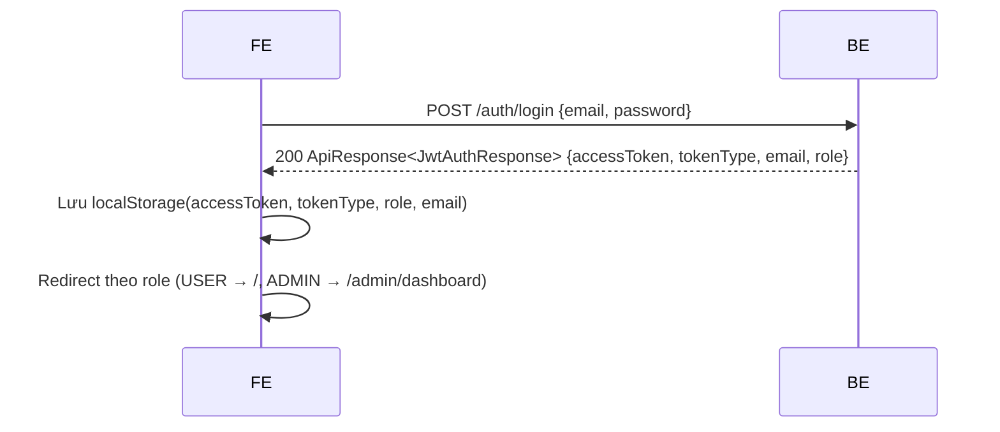
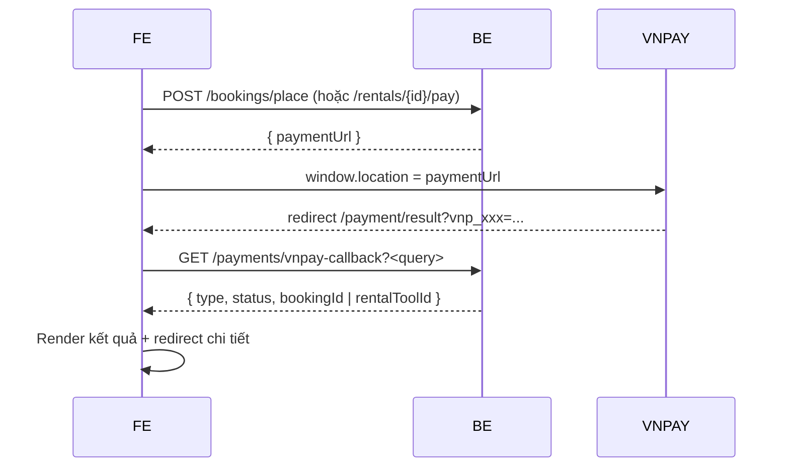

# Tài liệu Thiết kế Frontend — Hệ thống Quản lý Sân Bóng Đá

> Phiên bản: 1.0  
> Ngày cập nhật: 2026-05-10  
> Đối tượng: Frontend developer, UI/UX designer, BA/PM  
> Backend đi kèm: Spring Boot 3.4.x, Java 17 (đã refactor từ sân cầu lông sang sân bóng đá)

Tài liệu này mô tả cấu trúc, sitemap, chức năng và các thành phần UI cần xây dựng cho frontend. Mọi endpoint trong tài liệu này đều khớp với code backend hiện tại trong [src/main/java/com/example/quanly/controller/](../src/main/java/com/example/quanly/controller/).

---

## Mục lục

1. [Tổng quan & nguyên tắc](#1-tổng-quan--nguyên-tắc)
2. [Tech stack đề xuất](#2-tech-stack-đề-xuất)
3. [Kiến trúc & cấu trúc thư mục](#3-kiến-trúc--cấu-trúc-thư-mục)
4. [Sitemap & routing](#4-sitemap--routing)
5. [Authentication & Authorization](#5-authentication--authorization)
6. [Layout chung & shared components](#6-layout-chung--shared-components)
7. [Đặc tả page — Public](#7-đặc-tả-page--public)
8. [Đặc tả page — Người dùng (USER)](#8-đặc-tả-page--người-dùng-user)
9. [Đặc tả page — Admin / Staff](#9-đặc-tả-page--admin--staff)
10. [Realtime: SSE, AI chat, notification](#10-realtime-sse-ai-chat-notification)
11. [Form validation tổng hợp](#11-form-validation-tổng-hợp)
12. [Error handling, loading & empty state](#12-error-handling-loading--empty-state)
13. [Style guide & design system](#13-style-guide--design-system)
14. [Tích hợp VNPay](#14-tích-hợp-vnpay)
15. [Phụ lục: bảng tham chiếu enum](#15-phụ-lục-bảng-tham-chiếu-enum)

---

## 1. Tổng quan & nguyên tắc

### 1.1. Phạm vi sản phẩm

Frontend phục vụ 4 nhóm vai trò:

- **Khách (Guest)** — chưa đăng nhập, có thể duyệt sân, thiết bị, dùng AI chat tư vấn.
- **Người dùng (USER)** — đặt sân, thuê thiết bị, theo dõi lịch sử cá nhân.
- **Nhân viên (STAFF)** — quản lý booking, rental đến trạng thái hoàn tất.
- **Quản trị viên (ADMIN)** — toàn quyền: quản lý sân, thiết bị, người dùng, dashboard.

### 1.2. Nguyên tắc thiết kế

| Nguyên tắc | Giải thích |
|---|---|
| **API-first** | Tất cả nghiệp vụ phải đi qua REST API `/api/v1/...` — không ghép logic trên FE. |
| **Stateless auth** | Lưu JWT trong `localStorage` (key `accessToken`) + `tokenType` (mặc định `Bearer`). Hết hạn → redirect login. |
| **Mobile-first responsive** | Breakpoint chuẩn: `sm 640 / md 768 / lg 1024 / xl 1280`. |
| **Phản hồi tức thì** | Mọi request có trạng thái loading + lỗi rõ ràng; thao tác nguy hiểm phải confirm (modal). |
| **Realtime cho slot/notification** | Dùng SSE hoặc poll lại `available-times` khi user đang trong luồng đặt sân. |
| **Vietnamese-first** | Mặc định ngôn ngữ tiếng Việt; chuỗi tiền tệ định dạng `vi-VN` (`1.250.000 ₫`); ngày `dd/MM/yyyy`. |

### 1.3. Tham chiếu code backend

- Controllers: [src/main/java/com/example/quanly/controller/](../src/main/java/com/example/quanly/controller/)
- DTO: [src/main/java/com/example/quanly/domain/dto/](../src/main/java/com/example/quanly/domain/dto/)
- Schema: [src/main/resources/db/migration/V1__init_schema.sql](../src/main/resources/db/migration/V1__init_schema.sql)
- Cấu hình bảo mật: [src/main/java/com/example/quanly/config/SecurityConfiguration.java](../src/main/java/com/example/quanly/config/SecurityConfiguration.java)

---

## 2. Tech stack đề xuất

| Hạng mục | Đề xuất | Ghi chú |
|---|---|---|
| Framework | **Angular 17+** hoặc **Next.js 14 (React)** | Backend đã CORS sẵn `localhost:3000`, `4200`, `5173`. |
| Ngôn ngữ | TypeScript (strict mode) | |
| State management | NgRx / Pinia / Zustand / Redux Toolkit | Có thể nhẹ — chủ yếu cache user, cart booking. |
| HTTP client | Axios (React) hoặc Angular `HttpClient` + Interceptor | Bắt buộc interceptor gắn `Authorization`. |
| UI library | **Tailwind CSS** + Headless UI / **Ant Design** / **Material UI** | Chọn 1, không trộn. |
| Form | React Hook Form + Zod / Angular Reactive Forms | |
| Date | `date-fns` hoặc `dayjs` | Xử lý `yyyy-MM-dd`, `HH:mm`, `LocalDateTime`. |
| Realtime | `EventSource` (SSE) | Cho `/ai/chat` và `/ntfy-sse/{topic}`. |
| Charts | ApexCharts / Recharts / Chart.js | Cho dashboard admin. |
| File upload | FormData + native `<input type="file">` | Backend nhận `multipart/form-data`. |
| Routing | React Router / Angular Router | Có guard role. |
| Test | Vitest / Jest + Playwright e2e | |

### 2.1. Biến môi trường (`.env`)

```
VITE_API_BASE_URL=http://localhost:8080/api/v1
VITE_AI_SSE_URL=http://localhost:8080/api/v1/ai/chat
VITE_NTFY_SSE_BASE=http://localhost:8080/api/v1/ntfy-sse
VITE_VNPAY_RETURN_URL=http://localhost:5173/payment/result
```

---

## 3. Kiến trúc & cấu trúc thư mục

### 3.1. Cấu trúc tham khảo (React + Vite)

```
src/
├── api/
│   ├── client.ts              # axios instance + interceptor
│   ├── auth.api.ts
│   ├── product.api.ts
│   ├── booking.api.ts
│   ├── equipment.api.ts
│   ├── rental.api.ts
│   ├── payment.api.ts
│   ├── admin/                 # nhóm endpoint /admin
│   └── ai.api.ts
├── components/
│   ├── layout/                # Header, Footer, Sidebar, AdminShell
│   ├── ui/                    # Button, Modal, Toast, Skeleton
│   ├── booking/               # SlotPicker, HoldTimer, PriceBox
│   ├── equipment/             # EquipmentCard, StockBadge
│   └── chat/                  # AIChatWidget
├── pages/
│   ├── public/                # Home, Pitches, PitchDetail, Equipments, Login, Register, ForgotPassword
│   ├── client/                # Profile, BookingFlow, BookingHistory, RentalHistory
│   ├── admin/                 # Dashboard, Bookings, Rentals, Products, Equipments, Users, Stats
│   └── payment/               # PaymentResult, PaymentRedirect
├── hooks/
│   ├── useAuth.ts
│   ├── useHoldTimer.ts
│   ├── useNtfySse.ts
│   └── usePagination.ts
├── store/                     # Zustand / Redux slice
├── routes/
│   ├── index.tsx
│   ├── PrivateRoute.tsx
│   └── RoleGuard.tsx
├── utils/
│   ├── format.ts              # currency, date, phone
│   ├── jwt.ts
│   └── enum.ts                # bookingStatus → label
└── types/                     # TypeScript types khớp DTO backend
```

### 3.2. ApiResponse wrapper

Backend luôn trả về:

```ts
interface ApiResponse<T> {
  status: number;       // HTTP-like
  message?: string;
  errorCode?: string;
  path?: string;
  timestamp?: string;
  data?: T;
}
```

Mọi service FE phải `unwrap` `data` và đẩy `message`/`errorCode` vào toast khi lỗi.

---

## 4. Sitemap & routing

### 4.1. Bản đồ trang

```text
/
├── (public)
│   ├── /                              Trang chủ
│   ├── /pitches                       Danh sách sân (filter, search)
│   ├── /pitches/:id                   Chi tiết sân
│   ├── /equipments                    Danh sách thiết bị
│   ├── /equipments/:id                Chi tiết thiết bị
│   ├── /login
│   ├── /register
│   ├── /forgot-password
│   ├── /reset-password?token=...
│   └── /payment/result                Trang VNPay redirect về
│
├── (user)
│   ├── /profile                       Hồ sơ cá nhân
│   ├── /change-password
│   ├── /bookings/new/:productId       Wizard đặt sân
│   ├── /bookings/history              Lịch sử booking
│   ├── /bookings/history/:id          Chi tiết booking + rental kèm
│   ├── /rentals/new                   Form thuê thiết bị (DAILY / ON_SITE)
│   ├── /rentals/history               Lịch sử thuê
│   └── /payment/checkout              Trang trung gian → VNPay
│
└── (admin)
    └── /admin
        ├── /dashboard
        ├── /bookings                  (STAFF + ADMIN)
        ├── /bookings/:id              (STAFF + ADMIN)
        ├── /rentals                   (STAFF + ADMIN)
        ├── /rentals/:id               (STAFF + ADMIN)
        ├── /products                  (ADMIN)
        ├── /products/new
        ├── /products/:id/edit
        ├── /equipments                (ADMIN)
        ├── /equipments/new
        ├── /equipments/:id/edit
        ├── /equipment-stock           (ADMIN) — quản trị stock theo ngày
        ├── /equipment-statistics      (ADMIN)
        ├── /users                     (ADMIN)
        ├── /users/new
        ├── /users/:id/edit
        └── /reports/revenue           (ADMIN) — doanh thu theo khoảng ngày
```

### 4.2. Bảng quy đổi route ↔ vai trò

| Route prefix | Guest | USER | STAFF | ADMIN |
|---|:-:|:-:|:-:|:-:|
| `/`, `/pitches`, `/equipments`, `/login`, `/register`, `/forgot-password`, `/reset-password`, `/payment/result` | ✅ | ✅ | ✅ | ✅ |
| `/profile`, `/bookings/**`, `/rentals/**`, `/payment/checkout` | — | ✅ | ✅ | ✅ |
| `/admin/bookings/**`, `/admin/rentals/**` | — | — | ✅ | ✅ |
| `/admin/dashboard`, `/admin/products/**`, `/admin/equipments/**`, `/admin/users/**`, `/admin/equipment-statistics`, `/admin/reports/**` | — | — | — | ✅ |

`RoleGuard` đọc `role` từ JWT (claim `role` trong [JwtAuthResponse](../src/main/java/com/example/quanly/domain/dto/JwtAuthResponse.java)) và redirect `/` nếu không đủ quyền.

---

## 5. Authentication & Authorization

### 5.1. Luồng đăng nhập



### 5.2. HTTP Interceptor

- **Request**: Tự động chèn `Authorization: ${tokenType} ${accessToken}` cho tất cả request không phải `/auth/**` và không phải `/payments/vnpay-callback`.
- **Response 401**:
  1. Xóa token khỏi `localStorage`.
  2. Phát event `auth:logout` để các store clear.
  3. Lưu URL hiện tại vào `?next=...` rồi `redirect /login`.
- **Response 403**: Hiện toast "Bạn không có quyền truy cập" + redirect về trang trước đó.
- **Response 409 (Conflict)**: Đặc biệt với `bookings/hold` và `bookings/place` — không logout, hiển thị modal "Khung giờ đã có người giữ".
- **Response 5xx**: Toast "Hệ thống đang lỗi, vui lòng thử lại sau".

### 5.3. JWT decode

Đọc claims `role`, `sub` (email), `exp`. FE chủ động kiểm tra `exp` trước mỗi navigation; nếu hết hạn → logout.

### 5.4. Storage keys

| Key | Giá trị | Khi nào xóa |
|---|---|---|
| `accessToken` | JWT raw | Logout, 401, đổi mật khẩu |
| `tokenType` | `"Bearer"` | Cùng accessToken |
| `userRole` | `"USER" / "STAFF" / "ADMIN"` | Cùng accessToken |
| `userEmail` | Email | Cùng accessToken |
| `holdContext` | JSON `{subPitchId, availableTimeId, bookingDate, holdStartedAt}` | Sau khi place / hết hạn / hủy |

---

## 6. Layout chung & shared components

### 6.1. Public Header

```
┌────────────────────────────────────────────────────────────┐
│  LOGO   [ Sân bóng | Thiết bị | Tin tức | Liên hệ ]   🔔 👤 │
└────────────────────────────────────────────────────────────┘
```

- Khi chưa đăng nhập: nút **Đăng nhập** + **Đăng ký**.
- Khi đã đăng nhập: avatar dropdown → `Hồ sơ`, `Lịch sử đặt sân`, `Lịch sử thuê thiết bị`, `Đăng xuất`.
- Icon 🔔 — mở popover notification (SSE từ `/ntfy-sse/user-{userId}`).
- Trên màn hình ≥ `lg`: sticky top.

### 6.2. Footer

- Nhóm liên kết: Giới thiệu, Điều khoản, Chính sách bảo mật, Hỗ trợ.
- Hotline + email + social.
- Copyright cố định.

### 6.3. Admin Shell (sidebar layout)

```
┌──────┬────────────────────────────────────┐
│ NAV  │  TOPBAR (breadcrumb + user menu)   │
│      ├────────────────────────────────────┤
│      │                                    │
│      │           OUTLET                   │
│      │                                    │
└──────┴────────────────────────────────────┘
```

Sidebar group:

- **Tổng quan**: Dashboard
- **Đặt sân**: Bookings *(STAFF/ADMIN)*
- **Thuê thiết bị**: Rentals *(STAFF/ADMIN)*
- **Sân bóng**: Products *(ADMIN)*
- **Thiết bị**: Equipments, Stock theo ngày *(ADMIN)*
- **Người dùng**: Users *(ADMIN)*
- **Báo cáo**: Doanh thu, Thống kê thiết bị *(ADMIN)*

Sidebar collapsible, lưu trạng thái vào `localStorage`.

### 6.4. Shared components bắt buộc

| Component | Mục đích |
|---|---|
| `<Button variant="primary/ghost/danger">` | |
| `<Modal>`, `<ConfirmDialog>` | Xác nhận xóa, hủy booking |
| `<Toast>` / `<Notification>` | Thông báo system-wide |
| `<DataTable>` | Sort, paginate, search inline |
| `<Pagination>` | Khớp meta `currentPage`, `totalPages` |
| `<DatePicker>` `<TimePicker>` | i18n vi |
| `<FileUpload>` | Preview ảnh + size limit (5 MB) |
| `<EmptyState>` | Khi list rỗng |
| `<Skeleton>` | Trong lúc loading list/detail |
| `<PriceTag>` | Format VND, hiển thị giá gạch nếu có sale |
| `<StatusBadge>` | Map enum → label màu |
| `<HoldTimer>` | Countdown 03:00 cho hold booking |
| `<SlotGrid>` | Lưới ngày × khung giờ × sân con |
| `<AIChatWidget>` | Floating bubble góc phải dưới (mọi page public) |

### 6.5. Bảng màu cho status

| Enum | Màu nền | Màu chữ |
|---|---|---|
| `CHO_THANH_TOAN` | `amber-100` | `amber-800` |
| `DA_DAT` | `blue-100` | `blue-800` |
| `DA_THANH_TOAN` | `green-100` | `green-800` |
| `DA_HUY` | `red-100` | `red-800` |
| `PENDING` | `gray-100` | `gray-700` |
| `PAID` | `green-100` | `green-800` |
| `COMPLETED` | `blue-100` | `blue-800` |
| `CANCELLED` | `red-100` | `red-800` |

---

## 7. Đặc tả page — Public

### 7.1. Trang chủ — `/`

**Mục tiêu**: Giới thiệu hệ thống, dẫn user vào luồng đặt sân.

**API sử dụng**:
- `GET /api/v1/client/home?page=1`
  - Response: `{ products, equipments, topProducts, topEquipments, currentPage, totalPages }`

**Khu vực UI**:

| Section | Mô tả |
|---|---|
| Hero banner | Slogan + CTA "Đặt sân ngay" → `/pitches`. |
| Tìm sân nhanh | Form (địa điểm, ngày, khung giờ). Submit → `/pitches?address=...&date=...`. |
| Sân nổi bật | Grid 4 cột (lg) / 2 cột (md) / 1 cột (sm) hiển thị `topProducts`. Card: ảnh, tên, địa chỉ, giá từ, badge giảm giá. |
| Thiết bị thuê nhiều | Grid `topEquipments`. Card: tên, hãng, giá thuê/ngày. |
| Khu vực giới thiệu | 3 cột: chính sách, hướng dẫn, liên hệ. |
| Floating | `AIChatWidget` góc phải dưới. |

**Edge case**:
- API lỗi → fallback hero + skeleton card 6 ô.
- `topProducts` rỗng → hiển thị `<EmptyState>` "Đang cập nhật".

---

### 7.2. Danh sách sân — `/pitches`

**Mục tiêu**: Cho user lọc & tìm sân theo nhu cầu.

**API**:
- `GET /api/v1/products?search=&address=&price=&sort=&page=`
  - Query nhận **mảng** `address[]`, `price[]` (theo `ProductCriteriaDTO`).

**UI**:

```
┌───────────────────────┬───────────────────────────────────┐
│ FILTER                │ SEARCH BAR + SORT                 │
│  - Search box         │ [grid 3 cột product card]         │
│  - Khu vực (multi)    │  ...                              │
│  - Khoảng giá (multi) │ [pagination]                      │
│  - Reset              │                                   │
└───────────────────────┴───────────────────────────────────┘
```

**Filter behavior**:
- Mỗi lần thay filter → debounce 300 ms → push vào URL search params → re-fetch.
- "Khoảng giá" multi-select chip (dưới 200k, 200-500k, 500k-1tr, trên 1tr) — gửi chuỗi như `0-200000`, `200000-500000`...
- Sort options: `Mới nhất`, `Giá tăng`, `Giá giảm`, `Phổ biến`.

**Card**:
- Ảnh tỉ lệ 16:9, hover zoom.
- Tên sân, địa chỉ (1 dòng truncate), giá từ, số sân con (`quantity`), nhãn `-{sale}%` nếu `sale > 0`.
- CTA: `Xem chi tiết` → `/pitches/:id`.

**Empty**: `Không tìm thấy sân phù hợp` + nút "Xóa bộ lọc".

---

### 7.3. Chi tiết sân — `/pitches/:id`

**API**:
- `GET /api/v1/products/{productId}`
  - Response: `{ product, availableTime, discountPrice, equipments }`.

**UI**:

| Khối | Chi tiết |
|---|---|
| **Gallery** | Ảnh chính + thumbnails (nếu có). |
| **Thông tin** | Tên, địa chỉ + `addressDetail`, mô tả ngắn, owner. |
| **Giá & deposit** | `<PriceTag price={product.price} sale={product.sale} />`, "Đặt cọc: {depositPrice}". |
| **Khung giờ hoạt động** | Chip list từ `availableTime` (vd: 06:00, 07:00, …). |
| **Sân con** | Chip list `subPitchNames` (Sân số 1 / Sân số 2…). |
| **Thiết bị tại sân** | Carousel `equipments` — link tới `/equipments/:id`. |
| **Mô tả chi tiết** | Render HTML `detailDesc` (sanitize). |
| **CTA chính** | Nút lớn **"Đặt sân ngay"** → kiểm tra login → `/bookings/new/:id`. |
| **Bản đồ** | Iframe Google Maps theo `address` (optional). |

**Tab phụ**: Đánh giá (chưa có API — giữ chỗ "Tính năng đang phát triển").

**Edge case**:
- Sản phẩm `status = INACTIVE` → tắt nút đặt sân, hiện banner "Sân tạm ngưng nhận đặt".
- User chưa login bấm "Đặt sân" → modal nhanh "Bạn cần đăng nhập" → `/login?next=/bookings/new/:id`.

---

### 7.4. Danh sách thiết bị — `/equipments`

**API**:
- `GET /api/v1/equipments?factory[]=&price[]=&sort=&page=`

**UI**:
- Bố cục giống `/pitches` (filter trái + grid).
- Filter: Hãng (multi), Khoảng giá thuê/ngày (multi), Sort.
- Card: ảnh, tên, hãng, giá thuê/ngày + giá thuê/lần chơi, badge `Còn hàng / Hết hàng` từ `available`.

---

### 7.5. Chi tiết thiết bị — `/equipments/:id`

**API**:
- `GET /api/v1/equipments/{id}`
- (Tùy chọn) `POST /api/v1/equipment-stock` body `{equipmentId, date}` để check tồn kho theo ngày.

**UI**:
- Ảnh + tên + hãng + giá thuê (per day, per play).
- **Component check stock**: User chọn ngày → POST `/equipment-stock` → hiển thị `availableStock / totalStock`.
- Quantity selector + nút **"Thuê thiết bị"** → nếu login → `/rentals/new?equipmentId=…&date=…&quantity=…`.

**Edge case**:
- `availableStock = 0` → disable nút thuê + thông báo "Hết hàng cho ngày này".

---

### 7.6. Đăng nhập — `/login`

**API**: `POST /api/v1/auth/login` body `LoginRequest{email, password}` → `JwtAuthResponse`.

**UI**:
- Form đơn: email, password, checkbox "Ghi nhớ", link "Quên mật khẩu", submit.
- Liên kết "Chưa có tài khoản? Đăng ký".
- Social login: **không có ở backend** — không hiển thị.

**Validation FE**:
- Email regex chuẩn.
- Password tối thiểu 3 ký tự (theo `@Size(min=3)` trên backend).

**Sau khi login**:
- Lưu token + role.
- Đọc query `?next=` để redirect; mặc định: USER → `/`, STAFF → `/admin/bookings`, ADMIN → `/admin/dashboard`.

**Lỗi 401**: hiển thị inline "Email hoặc mật khẩu không đúng".

---

### 7.7. Đăng ký — `/register`

**API**: `POST /api/v1/auth/register` body `RegisterDTO{firstName, lastName, email, password, confirmPassword, phone}`.

**UI form** (1 cột, max-w-md):

| Field | Validation |
|---|---|
| Họ | Bắt buộc |
| Tên | Bắt buộc |
| Email | Bắt buộc + email pattern |
| Mật khẩu | Min 3 ký tự |
| Xác nhận mật khẩu | Min 3, **phải === Mật khẩu** (`@RegisterChecked`) |
| Số điện thoại | Bắt buộc, gợi ý 10–11 số |
| Checkbox đồng ý điều khoản | Bắt buộc trên FE (BE không bắt) |

**Sau khi thành công**: toast "Đăng ký thành công, vui lòng đăng nhập" → `/login`.

**Lỗi 400**: nếu BE trả message "Email đã tồn tại" → highlight field email.

---

### 7.8. Quên mật khẩu — `/forgot-password`

**API**: `POST /api/v1/auth/forgot-password` body `{email, redirectUrl}` (FE truyền `${origin}/reset-password`).

**UI**: ô email + nút "Gửi email khôi phục" → hiển thị thông báo "Đã gửi email, vui lòng kiểm tra hộp thư".

---

### 7.9. Đặt lại mật khẩu — `/reset-password?token=...`

**API**: `POST /api/v1/auth/reset-password` body `{token, password}`.

**UI**:
- Nếu thiếu/sai `token` → hiển thị "Liên kết không hợp lệ hoặc đã hết hạn".
- Form: mật khẩu mới + xác nhận → submit → toast → `/login`.

---

### 7.10. Trang kết quả thanh toán — `/payment/result`

VNPay redirect về URL này kèm query `vnp_ResponseCode`, `vnp_TxnRef`, ...

**Logic FE**:
1. Đọc query string.
2. Gọi `GET /api/v1/payments/vnpay-callback?...` (truyền nguyên query).
3. Backend trả `{type, status, bookingId | rentalToolId, ...}`.
4. Theo `type`:
   - `BOOKING` / `PENDING_BOOKING` → CTA "Xem chi tiết booking" → `/bookings/history/:bookingId`.
   - `RENTAL_TOOL` → CTA "Xem đơn thuê" → `/rentals/history` highlight `rentalToolId`.
5. Nếu `vnp_ResponseCode !== "00"` → hiển thị "Thanh toán thất bại" + nút "Thử lại" / "Về trang chủ".

**UI**:
- Icon trạng thái lớn (✓ / ✗) + tóm tắt số tiền + mã giao dịch + thời gian.
- Auto redirect về trang chi tiết sau 5s (có hủy).

---

## 8. Đặc tả page — Người dùng (USER)

### 8.1. Hồ sơ cá nhân — `/profile`

**API**:
- `GET /api/v1/client/profile` → `UserResponseDTO`.
- `PUT /api/v1/client/profile` (multipart) — gửi `User` JSON + `MultipartFile avatar`.

**UI**:

```
┌────────────┬──────────────────────────────────┐
│  AVATAR    │ Họ tên          [   ]            │
│  [đổi ảnh] │ Email (readonly)                 │
│            │ Số điện thoại   [   ]            │
│            │ Địa chỉ         [   ]            │
│            │ Member level    [GOLD] (badge)   │
│            │                  [Lưu thay đổi]  │
└────────────┴──────────────────────────────────┘
```

- Avatar: click → file picker (jpg/png ≤ 5 MB), preview ngay.
- Form gửi multipart: `user` (JSON blob) + `avatar` (file). Sau khi save → cập nhật store + toast.
- Hiển thị `memberLevel` dạng badge (`NORMAL` / `SILVER` / `GOLD`) — chỉ đọc.
- Link phụ: **Đổi mật khẩu** → `/change-password`.

---

### 8.2. Đổi mật khẩu — `/change-password`

**API**: `PUT /api/v1/client/change-password?oldPassword=&newPassword=&confirmPassword=`.

**Lưu ý**: BE nhận **query params**, không phải body — FE phải URL-encode.

**UI**: 3 ô password + submit. Sau thành công → **logout** + redirect `/login` với toast "Mật khẩu đã đổi, vui lòng đăng nhập lại".

---

### 8.3. Wizard đặt sân — `/bookings/new/:productId`

Đây là page **phức tạp nhất**. Nên triển khai dạng wizard 4 bước.

#### Step 1: Chọn ngày + sân con + khung giờ

**API**:
- `GET /api/v1/client/bookings/{productId}/info` → `{ product, courts, availableTimes, totalPrice }` (tổng quan để render khung).
- `GET /api/v1/client/bookings/recommend/{productId}` → `List<AvailableTimeDTO>` (gợi ý 3 khung giờ).
- `GET /api/v1/client/bookings/available-times?date=YYYY-MM-DD&courtId=...` → khung giờ còn trống.

**UI**:

```
[ DatePicker (>= today) ]   [ Loại đặt: O Một lần   O Lặp tuần (ngày kết thúc) ]

Sân con: [ Sân số 1 ] [ Sân số 2 ] [ Sân số 3 ]    ← chip select

Gợi ý cho bạn:  [17:00 ★]  [18:00 ★]  [19:00 ★]

Khung giờ:
┌──────┬──────┬──────┬──────┬──────┬──────┐
│06:00 │07:00 │08:00 │09:00 │10:00 │11:00 │
│ trống│ trống│ giữ  │ trống│ đã   │ trống│
│      │      │      │      │ đặt  │      │
└──────┴──────┴──────┴──────┴──────┴──────┘
```

- Slot có 4 trạng thái: `available` (xanh), `recommended` (xanh đậm + ★), `holding` (vàng — của user khác đang giữ), `booked` (xám gạch chéo).
- Sau khi chọn sân con + ngày → re-fetch `available-times` để xác định trạng thái.
- Nếu `bookingType = WEEKLY_RECURRING`: yêu cầu `recurringEndDate` ≥ `bookingDate`. Hiển thị xem trước "Sẽ đặt 5 buổi: 10/05, 17/05, 24/05, 31/05, 07/06". Cảnh báo nếu một trong các ngày tương lai không khả dụng — backend sẽ check lại lúc place.

#### Step 2: Hold slot + nhập thông tin người nhận

Sau khi user chọn 1 slot và bấm **"Tiếp tục"**:

**API**: `POST /api/v1/client/bookings/hold` body `HoldBookingRequest{subPitchId, availableTimeId, bookingDate}`.

- Nếu **200** → mở Step 2, khởi động `<HoldTimer>` countdown **3:00** (server lock 3 phút).
- Nếu **409 Conflict** → modal "Khung giờ vừa có người giữ, vui lòng chọn khung khác" → quay về Step 1.
- Nếu **400** → toast lỗi cụ thể.

**Form người nhận** (mặc định fill từ profile):

| Field | Validation |
|---|---|
| `receiverName` | `@NotBlank` |
| `receiverAddress` | `@NotBlank` |
| `receiverPhone` | `@NotBlank` + regex `^\d{10,11}$` |

**Hiển thị**:
- Tóm tắt: sân, sân con, ngày, khung giờ, kiểu đặt.
- Bảng giá: từng slot (nếu lặp tuần) + tổng giá + tiền cọc.
- Note: "Bạn chỉ thanh toán **tiền cọc**. Phần còn lại trả tại sân."

**Nút**: ⬅ Quay lại  |  Tiếp tục →

#### Step 3: Xác nhận & tạo đơn

**API**: `POST /api/v1/client/bookings/place` body `PlaceBookingRequest{ receiverName, receiverAddress, receiverPhone, productId, availableTimeId, courtId, bookingDate, bookingType, recurringEndDate? }`.

Backend trả `{paymentUrl}`.

**UI**:
- Hiển thị toàn bộ tóm tắt → checkbox "Tôi đồng ý điều khoản đặt sân" → nút **Thanh toán VNPay**.
- Khi click: `window.location.href = paymentUrl`. Trước đó lưu `holdContext` để Step 4 đọc nếu user back.

**Edge case 409**: "Khung giờ đã được người khác đặt thành công" → quay Step 1.

#### Step 4: Sau VNPay redirect → `/payment/result`

Logic ở mục 7.10. Hệ thống tự confirm booking nếu callback hợp lệ.

#### HoldTimer behavior

```ts
useHoldTimer(holdStartedAt, durationSec = 180, {
  onExpire: () => navigate('back to step 1, toast "Hết thời gian giữ chỗ"'),
  warningAt: 30, // bật nhấp nháy khi <30s
});
```

#### Bonus: thêm thiết bị (ON_SITE) tại Step 2.5 (optional)

**API**: `GET /api/v1/client/bookings/{bookingCode}/{courtId}/equipments` (chỉ dùng được sau khi có `bookingCode` — tức sau khi đã `place`. Có thể đưa vào trang chi tiết booking).

> Khuyến nghị: ON_SITE rental nên thêm tại trang **chi tiết booking** sau khi đã thanh toán, không lồng vào wizard.

---

### 8.4. Lịch sử đặt sân — `/bookings/history`

**API**: `GET /api/v1/client/booking-history?page=&size=`.

**UI**:
- DataTable cột: Mã đặt, Ngày, Khung giờ, Sân, Tổng tiền, Trạng thái, Thao tác.
- Filter top: theo trạng thái (chip), khoảng ngày.
- Hành động:
  - **Xem chi tiết** → `/bookings/history/:id`.
  - **Hủy** (nếu `CHO_THANH_TOAN` hoặc `DA_DAT` & ngày trong tương lai) — *hiện backend chưa expose endpoint hủy ở client; gắn nút disabled + tooltip "Liên hệ quản trị viên".*

---

### 8.5. Chi tiết booking — `/bookings/history/:id`

**API**: `GET /api/v1/client/booking-history/{id}` → `{ booking, bookingDetails, rentalTools }`.

**UI**:

```
┌──────────────────── Booking #BK-1700000000 ────────────────────┐
│ Trạng thái: [DA_THANH_TOAN]      Ngày đặt: 10/05/2026         │
│ Người nhận: ...   SĐT: ...   Địa chỉ: ...                     │
│ Tổng tiền: 1.250.000 ₫    Cọc: 200.000 ₫                      │
├────────────────────────────────────────────────────────────────┤
│ CHI TIẾT TỪNG BUỔI                                            │
│ [Sân số 1 — 17:00 — 10/05/2026 — 250.000 ₫ — sale 0%]         │
│ [Sân số 1 — 17:00 — 17/05/2026 — 250.000 ₫]                   │
│ ...                                                            │
├────────────────────────────────────────────────────────────────┤
│ THIẾT BỊ THUÊ KÈM (ON_SITE)                                   │
│ [Bóng size 5 — 50.000 ₫ × 1]   [+ Thêm thiết bị]              │
└────────────────────────────────────────────────────────────────┘
```

- Nút **+ Thêm thiết bị** (chỉ hiện khi booking `DA_THANH_TOAN` & ngày ≥ hôm nay):
  - Mở modal → fetch `GET /api/v1/client/bookings/{bookingCode}/{courtId}/equipments`.
  - Người dùng chọn thiết bị + quantity → `POST /api/v1/rentals` với `type=ON_SITE`, `bookingCode`.
  - Sau thành công → reload chi tiết.

---

### 8.6. Form thuê thiết bị (DAILY) — `/rentals/new`

**API tạo đơn**: `POST /api/v1/rentals` với `CreateRentalRequest`.

**Form**:

| Field | Loại | Validation |
|---|---|---|
| `fullName` | text | `@NotBlank`, mặc định fill profile |
| `email` | email | `@NotBlank` + email |
| `phone` | tel | `@NotBlank` |
| `type` | radio (DAILY / ON_SITE) | `@NotNull`. Mặc định DAILY trong route này. |
| `equipmentId` | autocomplete + ảnh thumbnail | `@NotNull` |
| `quantity` | number | `@Min(1)`, không vượt `availableStock` |
| `quantityDay` | number | bắt buộc khi DAILY, ≥ 1 |
| `rentalDate` | date | bắt buộc khi DAILY, ≥ hôm nay |
| `bookingCode` | text | bắt buộc khi ON_SITE (ẩn nếu DAILY) |

**Realtime stock**: khi đổi `equipmentId` hoặc `rentalDate` → POST `/equipment-stock` để cập nhật `availableStock` + cảnh báo nếu `quantity > availableStock`.

**Sau submit**:
- BE trả `RentalToolDTO` (status = `PENDING`).
- Hiện modal "Đơn đã tạo. Tiếp tục thanh toán?" → 2 nút:
  - **Thanh toán VNPay** → `POST /api/v1/rentals/{id}/pay` body `{paymentMethod: "VNPAY"}` → redirect `paymentUrl`.
  - **Trả tiền mặt** (chỉ STAFF/ADMIN có thể chọn — với USER thông thường ẩn) → body `{paymentMethod: "CASH"}` → toast thành công.

---

### 8.7. Lịch sử thuê thiết bị — `/rentals/history`

**API**: `GET /api/v1/client/rental-history?page=&size=`.

**UI**: bảng — Mã thuê, Thiết bị, Loại (DAILY/ON_SITE), Ngày thuê, Số ngày, Tổng tiền, Trạng thái, Thao tác.

- Hành động: Xem chi tiết (mở drawer), Thanh toán (nếu `PENDING`).

---

## 9. Đặc tả page — Admin / Staff

### 9.1. Dashboard — `/admin/dashboard` (ADMIN)

**API**:
- `GET /api/v1/admin/dashboard` → `{countUser, countProduct, countByEquipment}`.
- `GET /api/v1/admin/products/statistics/revenue?startDate=&endDate=` → doanh thu theo sân.
- `GET /api/v1/admin/equipment-statistics?startDate=&endDate=&courtId=` → thống kê thiết bị.

**UI**:

```
┌──────────────────────────────────────────────────────┐
│ KPI CARDS:  Người dùng | Sân | Thiết bị | Booking ?? │
├────────────────────────────┬─────────────────────────┤
│  Bar chart: Doanh thu      │ Donut: Top thiết bị     │
│  theo sân (range picker)   │ thuê nhiều              │
├────────────────────────────┼─────────────────────────┤
│ Line chart: Booking theo   │ Table: Booking gần đây │
│ tháng                      │                         │
└────────────────────────────┴─────────────────────────┘
```

- Date range picker mặc định: 30 ngày gần nhất.
- KPI cards có icon + biến động % (so với kỳ trước — tự tính FE).

---

### 9.2. Quản lý booking — `/admin/bookings` (STAFF/ADMIN)

**API**:
- `GET /api/v1/admin/bookings?date=&search=&page=&size=`.
- `GET /api/v1/admin/bookings/{id}`.
- `PUT /api/v1/admin/bookings/{id}/status` body `{status}` *(ADMIN)*.
- `DELETE /api/v1/admin/bookings/{id}` *(ADMIN)*.

**UI list**:

| Cột | Sortable |
|---|---|
| Mã đặt | ✓ |
| Khách hàng | ✓ |
| Ngày | ✓ |
| Sân | |
| Tổng tiền | ✓ |
| Trạng thái | ✓ |
| Thao tác | |

- Filter: search (tên/email/mã booking), date picker.
- Thao tác: Xem chi tiết, Đổi trạng thái (dropdown — chỉ ADMIN), Xóa (chỉ ADMIN, confirm dialog).

**UI detail** (`/admin/bookings/:id`): giống section 8.5 nhưng bổ sung khối thay đổi trạng thái + audit log (nếu có).

---

### 9.3. Quản lý đơn thuê — `/admin/rentals` (STAFF/ADMIN)

**API**:
- `GET /api/v1/admin/rentals?search=&page=&size=`.
- `GET /api/v1/admin/rentals/{id}`.
- `PUT /api/v1/admin/rentals/{id}/status` *(ADMIN)*.

UI tương tự 9.2.

---

### 9.4. Quản lý sân (Product) — `/admin/products` (ADMIN)

**API CRUD**:
- `GET /api/v1/admin/products?page=&search=`.
- `GET /api/v1/admin/products/{id}`.
- `POST /api/v1/admin/products` (multipart).
- `PUT /api/v1/admin/products/{id}` (multipart).
- `DELETE /api/v1/admin/products/{id}`.

**Form fields** (multipart):

| Field | Loại | Bắt buộc |
|---|---|---|
| `name` | text | ✓ |
| `image` | file | ✓ (khi tạo) |
| `price` | number | ✓ |
| `depositPrice` | number | ✓ |
| `quantity` | number — số sân con tổng | ✓ |
| `sale` | number 0–100 | |
| `address` | text | ✓ |
| `addressDetail` | text | |
| `shortDesc` | text | |
| `detailDesc` | rich text editor | |
| `status` | select (`ACTIVE` / `INACTIVE`) | ✓ |
| `userId` | select chủ sân | ✓ |
| `availableTimes` | multi-select khung giờ | ✓ (≥1) |
| `subPitches` | dynamic list (tên sân con) | ✓ (≥1) |

> Ghi chú: bảng `pitch_time` và `subpitch_available_time` được backend tự lưu. FE chỉ cần chọn `availableTimes` và `subPitches`. Nếu API hiện chưa nhận trực tiếp các trường này — kiểm tra với backend trước khi triển khai (hiện `Product` entity dùng `@Transient subPitchNames`).

**List UI**: bảng có ảnh thumbnail, tên, địa chỉ, số sân con, giá, trạng thái, thao tác (Sửa, Xóa, Xem doanh thu).

---

### 9.5. Quản lý thiết bị — `/admin/equipments` (ADMIN)

**API**:
- `GET /api/v1/admin/equipments?page=`.
- `GET /api/v1/admin/equipments/{id}`.
- `POST /api/v1/admin/equipments` (multipart).
- `PUT /api/v1/admin/equipments/{id}` (multipart).

**Form**:

| Field | Loại | Bắt buộc |
|---|---|---|
| `name` | text | ✓ |
| `factory` | text (hãng) | |
| `image` | file | ✓ (tạo mới) |
| `price` | number | ✓ |
| `rentalPricePerDay` | number | ✓ |
| `rentalPricePerPlay` | number | ✓ |
| `quantity` | number — tồn kho gốc | ✓ |
| `bookingStockQuantity` | number | |
| `available` | toggle | mặc định true |
| `status` | select | |
| `productId` | select sân thuộc về | ✓ |

**Sau khi tạo mới**: backend chạy async tạo 7 ngày `EquipmentStockByDate` đầu tiên. FE hiển thị toast "Đã tạo. Tồn kho 7 ngày tới đã được khởi tạo."

---

### 9.6. Tồn kho theo ngày — `/admin/equipment-stock` (ADMIN)

> Backend hiện expose `POST /api/v1/equipment-stock` (check stock) là public. Việc **chỉnh sửa** stock theo ngày chưa có endpoint admin — FE chỉ hiển thị read-only lịch tồn kho 7 ngày.

**UI**:
- Chọn thiết bị → hiển thị grid 7 ngày × cột (`availableStock`, `reservedStock`, `rentalStock`, `totalStock`).
- Cho mỗi ngày: bấm chip ngày → POST check-stock → render giá trị.
- Hiển thị note: "Stock được tự sinh lúc 0:00 hằng ngày + cập nhật reserved/rental theo booking."

---

### 9.7. Thống kê thiết bị — `/admin/equipment-statistics` (ADMIN)

**API**: `GET /api/v1/admin/equipment-statistics?startDate=&endDate=&courtId=`.

**UI**:
- Filter: range ngày + chọn sân (option All).
- Cards: Tổng thiết bị, Đang thuê, Lượt thuê tháng, Doanh thu tháng.
- Bar chart: `rentalsByMonth` + `revenueByMonth`.
- Bảng top thiết bị (`topEquipments`).
- Dropdown chuyển nhanh sân (`listProduct`).

---

### 9.8. Báo cáo doanh thu — `/admin/reports/revenue` (ADMIN)

**API**: `GET /api/v1/admin/products/statistics/revenue?startDate=&endDate=`.

**UI**:
- Range picker.
- Bảng: tên sân, doanh thu (₫). Sort theo doanh thu.
- Bar chart song song.
- Nút **Export CSV** (FE-side).

---

### 9.9. Quản lý người dùng — `/admin/users` (ADMIN)

**API**:
- `GET /api/v1/admin/users` → `List<UserResponseDTO>`.
- `GET /api/v1/admin/users/{id}`.
- `POST /api/v1/admin/users` (multipart).
- `PUT /api/v1/admin/users/{id}` (multipart).
- `PUT /api/v1/admin/users/{id}/role` body `{role}`.
- `DELETE /api/v1/admin/users/{id}`.

**UI list**: bảng có avatar, họ tên, email, SĐT, role, member level, thao tác.

**Form** (giống profile + thêm `password` khi tạo + select `role`).

**Đổi role**: dropdown trong row → confirm → `PUT .../role`.

**Edge case**: không cho phép user tự xóa chính mình (so sánh `userId` với `userEmail` từ JWT).

---

## 10. Realtime: SSE, AI chat, notification

### 10.1. AI Chat Widget (`/api/v1/ai/chat`)

- **Endpoint**: `POST /api/v1/ai/chat`, response `Flux<String>` (SSE).
- **Body**: `{ message, chatId? }` — `chatId` lưu localStorage để giữ context.
- **UI**: Floating bubble góc phải dưới, mở thành panel 380×560 px:

```
┌───────────────────────────┐
│ Trợ lý sân bóng    [_][x] │
├───────────────────────────┤
│ Bot: Xin chào! Bạn cần... │
│ User: Tìm sân ở Cầu Giấy  │
│ Bot: ▌ (đang gõ stream)   │
├───────────────────────────┤
│ [Nhập tin nhắn...]   [Gửi]│
└───────────────────────────┘
```

- Stream token-by-token, render markdown đơn giản.
- Quick actions chip: "Tìm sân gần tôi", "Sân nào còn trống tối nay?".
- Chỉ hiển thị ở public layout (không trong admin).

### 10.2. Notification SSE (`/api/v1/ntfy-sse/{topic}`)

- Sau khi user login → mở `EventSource` với `topic = user-{userId}`.
- `userId` lấy từ profile (gọi `GET /client/profile` 1 lần lưu store).
- Mỗi event JSON `{ message, title?, time }` → push vào notification dropdown header + toast.
- Dùng cho nhắc lịch đánh trước 1 giờ (scheduler `NtfyService` mỗi 30 phút).

### 10.3. Polling slot khi đặt sân

- Trong wizard step 1, mỗi 15 giây re-fetch `available-times` để cập nhật slot mới bị giữ/đặt.
- Khi user đang trong step 2 (đã hold), **không** refetch — đã có 3 phút lock.

### 10.4. WebSocket `/ws`

Backend đã permit `/ws/**` nhưng chưa implement. Tạm thời FE **không** dùng. Khi BE bật, sẽ mở rộng để chat realtime giữa user ↔ chủ sân.

---

## 11. Form validation tổng hợp

| Pattern | Áp dụng |
|---|---|
| Email | `^[a-zA-Z0-9_!#$%&'*+/=?\`{|}~^.-]+@[a-zA-Z0-9.-]+$` |
| Phone | `^\d{10,11}$` (10–11 số) |
| Password | min 3 ký tự (đồng bộ BE — FE nên gợi ý mạnh hơn ≥8) |
| Date | `yyyy-MM-dd`, không gửi past date trong các form đặt mới |
| Time | `HH:mm` |
| Money | input number ≥ 0, format hiển thị `Intl.NumberFormat('vi-VN', {style:'currency', currency:'VND'})` |
| Sale | 0–100 |

**Quy tắc UX**:
- Validation **on blur** lần đầu, sau đó **on change** cho field đã chạm.
- Hiển thị inline error đỏ dưới field, kèm icon ⚠.
- Submit button disabled khi form invalid; sau submit, focus field lỗi đầu tiên.

---

## 12. Error handling, loading & empty state

### 12.1. Phân loại

| HTTP | Hành vi mặc định |
|---|---|
| 200 / 201 | Toast success (nếu là action thay đổi). |
| 400 | Inline error theo field nếu BE trả `errorCode`; nếu không, toast `message`. |
| 401 | Logout + redirect login. |
| 403 | Toast quyền + giữ nguyên trang. |
| 404 | Trang `<NotFound>` (cho route) hoặc empty state (cho data). |
| 409 | Modal đặc thù (booking conflict). |
| 422 | Toast + log details. |
| 5xx | Toast generic + nút "Thử lại". |

### 12.2. Loading state

- Page-level: skeleton thay cho từng section (không spinner toàn trang).
- Action-level: nút disabled + spinner inline.
- Polling không hiển thị loading (silent refresh).

### 12.3. Empty state

Mỗi list cần có hình minh họa + tiêu đề + mô tả + CTA gợi ý:

> "Bạn chưa có booking nào. Hãy đặt sân đầu tiên! → Đi đến danh sách sân."

---

## 13. Style guide & design system

### 13.1. Bảng màu chính

| Token | HEX | Ý nghĩa |
|---|---|---|
| `primary-500` | `#16A34A` | Xanh lá — màu thương hiệu sân bóng |
| `primary-700` | `#15803D` | Hover/active |
| `accent-500` | `#F59E0B` | CTA phụ, badge giảm giá |
| `danger-500` | `#DC2626` | Lỗi, hủy |
| `surface-50` | `#F8FAFC` | Background chính |
| `surface-900` | `#0F172A` | Text chính |

### 13.2. Typography

- Font: **Inter** (latin) + **Be Vietnam Pro** (vi).
- Hierarchy: `text-3xl/2xl/xl/lg/base/sm/xs`.
- Heading bold 600, body 400.

### 13.3. Spacing

- Grid 4 px base.
- Card padding `p-4` (mobile) / `p-6` (desktop).
- Section vertical gap `space-y-8`.

### 13.4. Radius & elevation

- Card `rounded-xl shadow-sm`.
- Modal `rounded-2xl shadow-xl`.
- Input `rounded-lg border-gray-300 focus:border-primary-500`.

---

## 14. Tích hợp VNPay

### 14.1. Tổng quan luồng



### 14.2. Mock mode (dev)

Backend có `MockPaymentController` (`/api/v1/mock-payment`) để dev local.
- Khi BE đang ở mock: `paymentUrl` chứa `mock-payment` → FE vẫn redirect bình thường, mock page sẽ tự confirm.
- Không cần phân biệt môi trường ở FE.

### 14.3. Lưu ý

- **Không** lưu thông tin thẻ ở FE.
- `vnp_TxnRef` luôn có dạng `{pendingId}-{TYPE}` — đừng parse FE; gửi nguyên cho BE.
- Sau callback thành công, BE đã tạo `Booking`/`RentalTool` chính thức. FE chỉ hiển thị kết quả.

---

## 15. Phụ lục: bảng tham chiếu enum

### 15.1. BookingStatus

| Mã | Label hiển thị | Màu |
|---|---|---|
| `CHO_THANH_TOAN` | Chờ thanh toán | amber |
| `DA_DAT` | Đã đặt | blue |
| `DA_THANH_TOAN` | Đã thanh toán | green |
| `DA_HUY` | Đã hủy | red |

### 15.2. BookingType

| Mã | Label |
|---|---|
| `ONE_TIME` | Đặt một lần |
| `WEEKLY_RECURRING` | Đặt định kỳ hàng tuần |

### 15.3. RentalToolStatus

| Mã | Label | Màu |
|---|---|---|
| `PENDING` | Chờ thanh toán | gray |
| `PAID` | Đã thanh toán | green |
| `COMPLETED` | Hoàn thành | blue |
| `CANCELLED` | Đã hủy | red |

### 15.4. RentalType

| Mã | Label | Ghi chú |
|---|---|---|
| `DAILY` | Thuê theo ngày | Cần `rentalDate`, `quantityDay` |
| `ON_SITE` | Thuê tại sân | Cần `bookingCode` |

### 15.5. PaymentMethod

| Mã | Label |
|---|---|
| `VNPAY` | VNPay |
| `CASH` | Tiền mặt (chỉ STAFF/ADMIN ghi nhận) |

### 15.6. PaymentType

| Mã | Mô tả |
|---|---|
| `BOOKING` | Booking thanh toán đầy đủ |
| `RENTAL_TOOL` | Đơn thuê thiết bị |
| `PENDING_BOOKING` | Booking đang ở pending cache, chờ confirm |

### 15.7. Member level (User)

| Mã | Label | Giảm giá (BE) |
|---|---|---|
| `NORMAL` (default) | Thường | 0% |
| `SILVER` | Bạc | -10% |
| `GOLD` | Vàng | -20% |

> Giá đã được BE tính sẵn (`PricingService`). FE chỉ hiển thị giá cuối, không tự tính lại.

### 15.8. Bảng quy tắc tính giá (tham khảo)

| Điều kiện | Hệ số |
|---|---|
| Giờ vàng (17:00–22:00) | × 1.30 |
| Cuối tuần (Sat/Sun) | × 1.30 (chồng chỉ tính 1 lần) |
| Member SILVER | × 0.90 |
| Member GOLD | × 0.80 |

Thứ tự: `base × peakHour × vipDiscount`.

---

## Kết luận

Tài liệu này phủ toàn bộ chức năng mà backend đang cung cấp tại branch `football-stadium-management`:

- Public: home, danh sách sân, danh sách thiết bị, đăng nhập/đăng ký, quên mật khẩu, kết quả thanh toán.
- USER: profile, đổi mật khẩu, wizard đặt sân (hold/place/payment), thuê thiết bị, lịch sử.
- STAFF: quản lý booking & rental.
- ADMIN: dashboard, CRUD sân, CRUD thiết bị, quản lý user, thống kê thiết bị, báo cáo doanh thu, đổi role.
- Realtime: AI chat SSE, notification SSE.
- VNPay: redirect + callback.

Khi backend phát triển thêm (ví dụ: cancel booking, đánh giá sân, websocket chat), cần cập nhật lại các section tương ứng để FE và BE đồng bộ.
