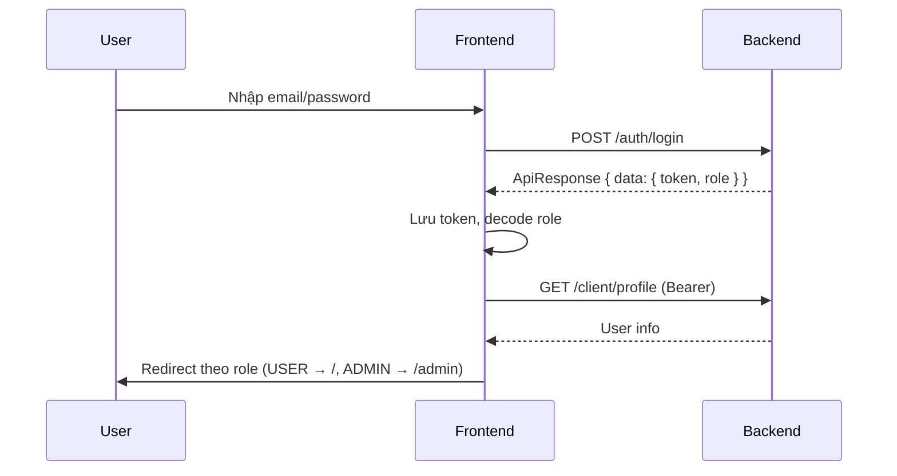

# Tài Liệu Thiết Kế Frontend - Dự Án Quản Lý Sân Pickleball

> Tài liệu này mô tả thiết kế frontend cho hệ thống `quanly`, giao tiếp với backend Spring Boot REST API hiện có. Phạm vi bao gồm kiến trúc, công nghệ, cấu trúc thư mục, routing, state, tích hợp API/WebSocket, thanh toán VNPay, phân quyền và chiến lược triển khai.

---

## 1. Tổng Quan

### 1.1. Mục tiêu

Frontend cung cấp ba nhóm trải nghiệm chính, dùng chung một codebase nhưng tách layout/route theo vai trò:

- **Khách (Guest):** xem sân, vợt, đăng ký, đăng nhập.
- **Người dùng (User):** đặt sân, thuê vợt, đăng/tham gia bài tìm trận, chat realtime, thanh toán VNPay, xem lịch sử.
- **Nhân viên & Quản trị (Staff/Admin):** dashboard, quản lý booking, rental, sản phẩm, vợt, người dùng, thống kê.

### 1.2. Nguyên tắc thiết kế

- **API-first:** mọi nghiệp vụ đều qua REST `/api/v1/**` đã chuẩn `ApiResponse<T>`.
- **Stateless auth:** JWT lưu ở client, gắn vào header `Authorization: Bearer <token>`.
- **Tách miền:** module `public` / `client` / `admin` độc lập về route và layout.
- **Realtime đúng chỗ:** chỉ dùng STOMP WebSocket cho chat & cập nhật bài tìm trận; dùng SSE/ntfy cho thông báo.
- **Responsive ưu tiên mobile:** người dùng đặt sân chủ yếu trên điện thoại.

---

## 2. Công Nghệ Đề Xuất

### 2.1. Stack chính

| Lớp | Lựa chọn đề xuất | Lý do |
|---|---|---|
| Framework | **Angular 17+** | Tích hợp sẵn TypeScript, cấu trúc rõ ràng phù hợp dự án lớn, tương thích với cấu hình hiện tại |
| Ngôn ngữ | TypeScript | Đồng bộ DTO với backend, giảm lỗi runtime |
| UI Library | **Angular Material + TailwindCSS** | Component chuẩn, customizable, thiết kế responsive |
| State Server | **RxJS / HttpClient** | Tích hợp sẵn trong Angular, quản lý asynchronous data stream tốt |
| State Client | **Signals / RxJS BehaviorSubject** | Quản lý state gọn nhẹ, thay thế cho thư viện ngoài |
| Form | **Reactive Forms** | Validate đồng bộ, quản lý state form phức tạp tốt |
| Routing | Angular Router | Phân nhóm route theo role, lazy loading, guards tích hợp sẵn |
| HTTP | **Axios** với interceptor | Gắn JWT, refresh, chuẩn hoá lỗi `ApiResponse` |
| WebSocket | **@stomp/stompjs + sockjs-client** | Backend dùng STOMP qua endpoint `/ws` |
| Chart | **Recharts** hoặc **Chart.js** | Dashboard doanh thu, top racket |
| Date | **dayjs** + **dayjs/locale/vi** | Format giờ slot đặt sân |
| i18n (tuỳ chọn) | i18next | Hỗ trợ vi/en |
| Build/Deploy | Vite build → Nginx hoặc Vercel | Static hosting + reverse proxy |

> **Lưu ý cấu hình hiện tại:** `application.properties` đặt `payment.vnPay.returnUrl=http://localhost:4200/payments/vnpay-callback`. Nếu chọn framework chạy cổng khác (3000/5173), cần cập nhật env `VNPAY_RETURN_URL` hoặc đổi port dev.

### 2.2. Biến môi trường frontend (`.env`)

```dotenv
VITE_API_BASE_URL=http://localhost:8080/api/v1
VITE_WS_URL=http://localhost:8080/ws
VITE_VNPAY_RETURN_PATH=/payments/vnpay-callback
VITE_NTFY_SSE_URL=http://localhost:8080/api/v1/ntfy-sse
VITE_VAPID_PUBLIC_KEY=<copy_từ_backend>
```

---

## 3. Kiến Trúc Frontend

### 3.1. Sơ đồ tổng thể

```text
                 ┌──────────────────────────┐
                 │       Browser (SPA)      │
                 │  Angular + Router + RxJS  │
                 └──────────────┬───────────┘
                                │
        ┌───────────────────────┼─────────────────────────┐
        │                       │                         │
        ▼                       ▼                         ▼
   Axios client            STOMP client              SSE / Push
   (REST /api/v1)          (WS /ws → /topic,         (ntfy-sse,
                            /queue, /app)             Web Push)
        │                       │                         │
        └───────────────────────┴─────────────────────────┘
                                │
                                ▼
                  Spring Boot Backend (8080)
```

### 3.2. Phân tầng module

```text
src/
├── app/                # Khởi tạo app, router, providers
├── shared/             # Hằng số, types, utils, hooks chung
├── api/                # Axios client, endpoint definitions, hooks Query
├── auth/               # Login, register, JWT, guards
├── components/         # UI tái sử dụng (Button, Modal, DataTable...)
├── features/
│   ├── home/
│   ├── product/        # Danh sách & chi tiết sân
│   ├── racket/         # Danh sách & chi tiết vợt
│   ├── booking/        # Đặt sân, hold, place, lịch sử
│   ├── rental/         # Thuê vợt, lịch sử thuê
│   ├── match-post/     # Tìm trận, join, leave, kick
│   ├── chat/           # WebSocket chat
│   ├── payment/        # VNPay callback xử lý
│   ├── profile/        # Profile, đổi mật khẩu
│   └── admin/
│       ├── dashboard/
│       ├── users/
│       ├── products/
│       ├── rackets/
│       ├── bookings/
│       └── rentals/
└── assets/
```

---

## 4. Cấu Trúc Routing

### 4.1. Route công khai

| Path | Trang | Quyền |
|---|---|---|
| `/` | Trang chủ (danh sách sân nổi bật, banner) | Guest |
| `/login` | Đăng nhập | Guest |
| `/register` | Đăng ký | Guest |
| `/forgot-password` | Quên mật khẩu | Guest |
| `/reset-password?token=...` | Đặt lại mật khẩu | Guest |
| `/products` | Danh sách sân + filter | Guest |
| `/products/:productId` | Chi tiết sân | Guest |
| `/rackets` | Danh sách vợt | Guest |
| `/rackets/:racketId` | Chi tiết vợt | Guest |
| `/payments/vnpay-callback` | Hứng callback VNPay (đọc query, gọi backend xác nhận) | Guest |

### 4.2. Route người dùng (yêu cầu JWT)

| Path | Trang | Mô tả |
|---|---|---|
| `/profile` | Hồ sơ | GET/PUT `/client/profile` |
| `/profile/change-password` | Đổi mật khẩu | `PUT /client/change-password` |
| `/products/:id/booking` | Form đặt sân | Hold + place |
| `/booking-history` | Lịch sử đặt sân | `/client/booking-history` |
| `/booking-history/:id` | Chi tiết booking | |
| `/rentals/new` | Tạo đơn thuê vợt | `POST /rentals` |
| `/rental-history` | Lịch sử thuê | `/client/rental-history` |
| `/match-posts` | Tìm trận | List + filter |
| `/match-posts/new` | Đăng bài | `POST /match-posts` |
| `/match-posts/:id` | Chi tiết + chat | WS room |
| `/notifications` | SSE notification feed | |

### 4.3. Route admin (`/admin/**` - role `ADMIN`/`STAFF`)

| Path | Trang |
|---|---|
| `/admin` | Dashboard (revenue, bookings hôm nay) |
| `/admin/users` | Quản lý người dùng |
| `/admin/products` | CRUD sản phẩm/sân |
| `/admin/rackets` | CRUD vợt |
| `/admin/rackets/stock` | Stock theo ngày |
| `/admin/bookings` | Danh sách booking |
| `/admin/bookings/:id` | Chi tiết |
| `/admin/rentals` | Danh sách rental |
| `/admin/rentals/:id` | Chi tiết + đổi trạng thái |
| `/admin/statistics/rackets` | Top racket |

### 4.4. Guard

- `<PublicRoute>`: Tự redirect `/` nếu đã login.
- `<PrivateRoute roles={['USER']}>`: Bắt buộc đăng nhập.
- `<AdminRoute roles={['ADMIN','STAFF']}>`: Phân theo role.
- Guard đọc role từ JWT đã decode (claim `role` hoặc qua `/client/profile`).

---

## 5. Tích Hợp API

### 5.1. Axios client

```ts
// src/api/http.ts
const http = axios.create({
  baseURL: import.meta.env.VITE_API_BASE_URL,
  timeout: 15000,
});

http.interceptors.request.use((config) => {
  const token = authStore.getState().token;
  if (token) config.headers.Authorization = `Bearer ${token}`;
  return config;
});

http.interceptors.response.use(
  (res) => res.data,                 // unwrap ApiResponse<T> ở data layer
  (err) => {
    const api = err.response?.data;  // { status, message, errorCode, path }
    if (api?.status === 401) authStore.getState().logout();
    return Promise.reject(api ?? err);
  }
);
```

### 5.2. Quy ước hook React Query

- Query key tổ chức dạng tuple: `['products', { criteria }]`, `['booking', id]`.
- Mutation luôn `invalidateQueries` đúng key sau khi thành công (ví dụ tạo booking → invalidate `['booking-history']`).
- Bật `staleTime` 30s cho danh sách, 0 cho dữ liệu thời gian thực (slot trống).

### 5.3. Bảng endpoint chính (đối chiếu backend)

| Module | Method | Path | Hook đề xuất |
|---|---|---|---|
| Auth | POST | `/auth/login` | `useLogin` |
| Auth | POST | `/auth/register` | `useRegister` |
| Auth | POST | `/auth/forgot-password` | `useForgotPassword` |
| Auth | POST | `/auth/reset-password` | `useResetPassword` |
| Profile | GET/PUT | `/client/profile` | `useProfile`, `useUpdateProfile` |
| Profile | PUT | `/client/change-password` | `useChangePassword` |
| Product | GET | `/products`, `/products/{id}` | `useProducts`, `useProduct` |
| Racket | GET | `/rackets`, `/rackets/{id}` | `useRackets`, `useRacket` |
| Booking | GET | `/client/bookings/{productId}/info` | `useBookingInfo` |
| Booking | GET | `/client/bookings/available-times` | `useAvailableTimes` |
| Booking | GET | `/client/bookings/recommend/{productId}` | `useRecommendSlots` |
| Booking | POST | `/client/bookings/hold` | `useHoldBooking` |
| Booking | POST | `/client/bookings/place` | `usePlaceBooking` |
| Booking | GET | `/client/booking-history`, `/{id}` | `useBookingHistory` |
| Rental | POST | `/rentals` | `useCreateRental` |
| Rental | POST | `/rentals/{id}/pay` | `usePayRental` |
| Rental | GET | `/client/rental-history` | `useRentalHistory` |
| MatchPost | GET/POST | `/match-posts` | `useMatchPosts` |
| MatchPost | POST | `/match-posts/{id}/join,leave,cancel` | mutation |
| Chat | GET | `/chat/history/{chatRoomId}` | `useChatHistory` |
| Payment | GET | `/payments/vnpay-callback` | gọi sau khi VNPay redirect |
| Admin | GET | `/admin/products`, `/admin/rackets`, `/admin/rentals`... | hook tương ứng |

---

## 6. Luồng Xác Thực

### 6.1. Lưu trữ token

- **Đề xuất:** lưu access token trong `memory + sessionStorage` (an toàn hơn `localStorage` trước XSS, đủ cho session ngắn 24h theo `jwt.expiration=86400000`).
- Nếu cần "remember me", lưu trong `localStorage` với mã hoá nhẹ hoặc dùng cookie HttpOnly nếu backend hỗ trợ.

### 6.2. Sơ đồ flow



### 6.3. Xử lý hết hạn

- Interceptor bắt `status: 401` → clear token, redirect `/login`, hiển thị toast "Phiên hết hạn".
- Không có refresh token ở backend hiện tại; có thể đề xuất bổ sung sau.

---

## 7. Luồng Đặt Sân (Booking)

### 7.1. UI flow

1. User vào `/products/:id` → xem thông tin sân, chọn ngày.
2. Component **TimeSlotPicker** gọi `/client/bookings/{productId}/info` lấy SubCourt + slot.
3. Khi user chọn slot, gọi `/client/bookings/available-times` để cross-check.
4. Có thể gọi `/client/bookings/recommend/{productId}` để highlight slot gợi ý theo lịch sử.
5. Bấm **"Giữ chỗ"** → `POST /client/bookings/hold` (gửi `HoldBookingRequest`). Lưu `holdId` + countdown.
6. Form thanh toán: chọn loại (1 lần / lặp tuần), bấm **"Xác nhận đặt sân"** → `POST /client/bookings/place` (`PlaceBookingRequest`).
7. Backend trả `paymentUrl` (VNPay) → `window.location = paymentUrl`.
8. Sau khi thanh toán xong, VNPay redirect về `/payments/vnpay-callback?vnp_*` → trang này gọi backend callback hoặc nhận kết quả từ query, hiển thị status + redirect `/booking-history/:id`.

### 7.2. Component chính

- `<DateSelector />`: chọn ngày, default hôm nay, lock quá khứ.
- `<SubCourtTabs />`: tab cho từng SubCourt.
- `<TimeSlotGrid />`: hiển thị 1 hàng các slot 60'/30', trạng thái `available | held | booked | unavailable`.
- `<HoldCountdown />`: timer 5'/15' để giữ chỗ; expire → invalidate.
- `<RecurringPicker />`: cho phép chọn lặp tuần.

### 7.3. Trạng thái UI

| Trạng thái slot | Màu | Tương tác |
|---|---|---|
| Trống | Trắng + border xanh | Chọn được |
| Đang chọn | Xanh đậm | Toggle |
| Giữ chỗ tạm | Vàng | Disabled (người khác) |
| Đã đặt | Xám | Disabled |
| Không khả dụng | Đỏ nhạt | Disabled |

---

## 8. Luồng Thuê Vợt

1. Trang `/rentals/new`: chọn `RentalType` (`BY_DAY` hoặc `AT_COURT`).
2. Nếu `BY_DAY`: chọn ngày → gọi `POST /rentals/check-stock` (nếu có) hoặc đọc `/racket-stock` để biết tồn.
3. Submit form `CreateRentalRequest` → `POST /rentals` → trả về `rentalId` + price.
4. Bấm thanh toán → `POST /rentals/{id}/pay` → nhận `paymentUrl` → redirect VNPay.
5. Sau callback, kiểm tra `/client/rental-history` để xem trạng thái `PAID`.

---

## 9. Match-Post & Chat Realtime

### 9.1. WebSocket setup

```ts
import { Client } from '@stomp/stompjs';
import SockJS from 'sockjs-client';

const client = new Client({
  webSocketFactory: () => new SockJS(import.meta.env.VITE_WS_URL),
  connectHeaders: { Authorization: `Bearer ${token}` },
  reconnectDelay: 3000,
});

client.onConnect = () => {
  client.subscribe(`/topic/chat/${chatRoomId}`, (msg) => {
    const message = JSON.parse(msg.body);
    queryClient.setQueryData(['chat', chatRoomId], (old) => [...(old ?? []), message]);
  });
};
```

### 9.2. Send message

```ts
client.publish({
  destination: `/app/chat/${chatRoomId}`,
  body: JSON.stringify({ content, type: 'TEXT' }),
});
```

### 9.3. UI

- `<MatchPostList />`: filter theo location, date, level.
- `<MatchPostDetail />`: thông tin + danh sách participant + nút join/leave/cancel.
- `<ChatRoom />`: ô tin nhắn realtime, autoscroll, load history qua `/chat/history/{roomId}`.
- Owner thấy nút "Kick" cho mỗi member → `POST /match-posts/{postId}/kick/{userId}`.

---

## 10. Thanh Toán VNPay

### 10.1. Outbound

- Frontend không tự build URL VNPay; backend trả `paymentUrl` qua API.
- Trước khi redirect, lưu `returnContext` (booking id, rental id) vào `sessionStorage` để xử lý sau callback.

### 10.2. Trang callback `/payments/vnpay-callback`

- Đọc tất cả query `vnp_*`.
- Hiển thị spinner "Đang xác nhận thanh toán..."
- Backend đã có endpoint xác thực và cập nhật trạng thái → frontend chỉ cần đọc kết quả `vnp_ResponseCode`:
  - `00` → success → toast "Thanh toán thành công" → redirect lịch sử tương ứng.
  - Khác → toast lỗi + nút thử lại.
- Sau đó **invalidate** các query `['booking-history']`, `['rental-history']`.

### 10.3. Mock payment

Backend có `payment.mock.enabled=true`. Khi mock, paymentUrl có thể là internal route. FE nên xử lý gracefully (vẫn redirect bình thường).

---

## 11. Notification & SSE

### 11.1. SSE feed

- Endpoint public `/api/v1/ntfy-sse/{topic}`.
- Mở `EventSource` khi user login, topic = `user-{userId}` hoặc topic admin.
- Hiển thị badge số thông báo trên header.

```ts
const es = new EventSource(`${VITE_NTFY_SSE_URL}/user-${userId}`);
es.onmessage = (e) => notificationStore.push(JSON.parse(e.data));
```

### 11.2. Web Push (tuỳ chọn)

- Đăng ký service worker.
- Subscribe với `VAPID_PUBLIC_KEY` đã expose qua env.
- Gửi subscription lên backend (nếu có endpoint).

---

## 12. UI / UX

### 12.1. Hệ thống design token

```ts
// tailwind.config.ts (rút gọn)
colors: {
  primary:   { 50:'#eef9f2', 500:'#16a34a', 700:'#0f7a37' }, // xanh pickleball
  accent:    { 500:'#f59e0b' }, // vàng giữ chỗ
  danger:    { 500:'#ef4444' },
  surface:   '#ffffff',
  muted:     '#f3f4f6',
},
fontFamily: { sans: ['Inter','system-ui'] },
borderRadius: { md:'8px', lg:'12px', xl:'16px' },
```

### 12.2. Layout

- **PublicLayout:** header (logo, nav, login), main, footer.
- **ClientLayout:** header với avatar dropdown (profile, history, logout), bell notification, content.
- **AdminLayout:** sidebar trái (Dashboard, Users, Products, Rackets, Bookings, Rentals, Stats), header phải, breadcrumb.

### 12.3. Component tái sử dụng (gợi ý theo `shadcn/ui`)

- `<DataTable />`: sort, pagination, server-side.
- `<FormField />`: integrate React Hook Form + Zod.
- `<ConfirmDialog />`.
- `<DateRangePicker />`.
- `<PriceTag />`, `<StatusBadge />` map enum `BookingStatus`, `RentalToolStatus`.
- `<Toaster />` để hiển thị message từ `ApiResponse.message`.

### 12.4. Responsive breakpoint

- `sm` 640, `md` 768, `lg` 1024, `xl` 1280.
- Booking grid chuyển 1 cột trên mobile; admin sidebar collapse thành drawer.

### 12.5. Accessibility

- Semantic HTML, label cho form.
- Focus ring rõ ràng (Tailwind `focus-visible:ring-2`).
- Contrast ≥ 4.5:1.
- Aria-live cho thông báo countdown giữ chỗ.

---

## 13. Quản Lý State

### 13.1. Server state (TanStack Query)

- Toàn bộ dữ liệu từ API.
- Tự retry 1 lần, không retry trên 4xx.

### 13.2. Client state (Zustand)

```ts
// authStore
{
  token: string | null,
  user: UserResponseDTO | null,
  setAuth, logout
}

// bookingDraftStore
{
  productId, date, selectedSlots, holdId, holdExpiresAt,
  reset()
}

// notificationStore
{
  items: Notification[], unreadCount, push, markRead
}
```

### 13.3. URL state

- Filter trang list (product, racket, match-post) đẩy lên query string (`?location=...&minPrice=...`) để chia sẻ link & back/forward hoạt động đúng.

---

## 14. Xử Lý Lỗi

### 14.1. Chuẩn lỗi

Backend trả `ApiResponse { status, message, errorCode, path }` với `GlobalExceptionHandler`. Frontend map:

| `errorCode` (ví dụ) | Hành vi FE |
|---|---|
| `VALIDATION_FAILED` | Hiện lỗi từng field từ `data` (map field → message) |
| `BOOKING_CONFLICT` | Toast đỏ + refresh slot |
| `HOLD_EXPIRED` | Reset bookingDraft, hiện modal |
| `RACKET_OUT_OF_STOCK` | Disable submit |
| `UNAUTHORIZED` | Redirect `/login` |
| Khác | Toast `message` |

### 14.2. ErrorBoundary

- Một `<RootErrorBoundary />` ở app root: hứng lỗi render, hiển thị trang "Đã có lỗi xảy ra, tải lại trang".

---

## 15. Bảo Mật Phía FE

- Không log token ra console.
- Sanitize input chat (escape HTML) trước khi render.
- Disable form submit double click.
- CSP header (cấu hình ở Nginx) tối thiểu cho phép `connect-src` tới backend + VNPay.
- Bật `SameSite=Lax` cho mọi cookie nếu có dùng.

---

## 16. Hiệu Năng

- Code splitting theo route (`React.lazy` / Next dynamic).
- Prefetch danh sách sân ở trang chủ.
- `staleTime` hợp lý để bớt request.
- Ảnh sân/vợt: serve qua CDN, sử dụng ``, format webp.
- Virtualize danh sách dài (admin booking) bằng `@tanstack/react-virtual`.

---

## 17. Kiểm Thử Frontend

| Cấp | Công cụ | Phạm vi |
|---|---|---|
| Unit | Vitest + React Testing Library | utils, hook nhỏ |
| Component | RTL | TimeSlotGrid, BookingForm validation |
| Integration | Mock Service Worker (msw) | Flow booking, login |
| E2E | Playwright | Đăng nhập → đặt sân → callback giả VNPay |

CI: chạy `lint`, `typecheck`, `test` mỗi PR.

---

## 18. Cấu Trúc Thư Mục Đề Xuất Đầy Đủ

```text
frontend/
├── public/
│   ├── favicon.svg
│   └── sw.js                          # service worker (tuỳ chọn)
├── src/
│   ├── app/
│   │   ├── App.tsx
│   │   ├── routes.tsx
│   │   └── providers.tsx              # QueryClientProvider, Theme, Toaster
│   ├── api/
│   │   ├── http.ts
│   │   ├── auth.api.ts
│   │   ├── product.api.ts
│   │   ├── booking.api.ts
│   │   ├── rental.api.ts
│   │   ├── match-post.api.ts
│   │   ├── admin.api.ts
│   │   └── types.ts                   # mirror DTO backend
│   ├── auth/
│   │   ├── authStore.ts
│   │   ├── PrivateRoute.tsx
│   │   └── AdminRoute.tsx
│   ├── components/                    # UI atoms/molecules
│   ├── features/
│   │   ├── home/
│   │   ├── product/
│   │   ├── booking/
│   │   ├── rental/
│   │   ├── match-post/
│   │   ├── chat/
│   │   ├── payment/
│   │   ├── profile/
│   │   └── admin/
│   ├── hooks/                         # useDebounce, useCountdown, useStomp
│   ├── lib/                           # dayjs, format, currency
│   ├── shared/
│   │   ├── constants.ts
│   │   ├── enums.ts                   # BookingStatus, RentalType...
│   │   └── i18n.ts
│   └── styles/
│       └── index.css
├── .env
├── tailwind.config.ts
├── tsconfig.json
└── vite.config.ts
```

---

## 19. Đặc Tả Dữ Liệu Trả Về (Response Reference)

> Tất cả endpoint đều bọc trong `ApiResponse<T>` (xem `ApiResponse.java`). Phần này liệt kê **chính xác** schema của `data` cho từng API để frontend mapping đúng từ ngày 1. Type TypeScript ở `src/api/types.ts` phải mirror đúng các shape dưới.

### 19.0. Envelope chuẩn

Mọi response thành công lẫn lỗi đều theo cấu trúc:

```jsonc
{
  "status":    200,                      // HTTP status int
  "message":   "Thành công",             // human-readable (tiếng Việt)
  "errorCode": null,                     // null nếu ok; mã lỗi khi fail (vd "VALIDATION_FAILED")
  "path":      null,                     // request path khi có lỗi
  "timestamp": "2026-05-12T03:21:11Z",   // ISO-8601 UTC
  "data":      { /* payload */ }         // body chính - shape tuỳ endpoint
}
```

TypeScript cốt lõi:

```ts
export interface ApiResponse<T> {
  status: number;
  message: string;
  errorCode?: string | null;
  path?: string | null;
  timestamp: string;
  data: T | null;
}
```

### 19.1. Enum dùng chung (giá trị backend trả về dạng `string`)

| Enum | Giá trị thực tế | Label hiển thị |
|---|---|---|
| `BookingStatus` | `CHO_THANH_TOAN` \| `DA_DAT` \| `DA_THANH_TOAN` \| `DA_HUY` | "Chờ thanh toán" / "Đã đặt" / "Đã thanh toán" / "Đã hủy" |
| `BookingType`   | `ONE_TIME` \| `WEEKLY_RECURRING` | "Đặt 1 lần" / "Đặt lặp tuần" |
| `RentalType`    | `DAILY` \| `ON_SITE` | "Thuê theo ngày" / "Thuê tại sân" |
| `RentalToolStatus` | `PENDING` \| `PAID` \| `COMPLETED` \| `CANCELLED` | "Chờ thanh toán" / "Đã thanh toán" / "Hoàn thành" / "Đã hủy" |
| `PaymentMethod` | `VNPAY` \| `CASH` | - |
| `PaymentType`   | `PENDING_BOOKING` \| `RENTAL_TOOL` | - |
| `Role` (JWT)    | `ROLE_USER` \| `ROLE_STAFF` \| `ROLE_ADMIN` | (giữ prefix `ROLE_`) |

```ts
export type BookingStatus = 'CHO_THANH_TOAN' | 'DA_DAT' | 'DA_THANH_TOAN' | 'DA_HUY';
export type BookingType   = 'ONE_TIME' | 'WEEKLY_RECURRING';
export type RentalType    = 'DAILY' | 'ON_SITE';
export type RentalToolStatus = 'PENDING' | 'PAID' | 'COMPLETED' | 'CANCELLED';
export type PaymentMethod = 'VNPAY' | 'CASH';
export type PaymentType   = 'PENDING_BOOKING' | 'RENTAL_TOOL';
export type Role          = 'ROLE_USER' | 'ROLE_STAFF' | 'ROLE_ADMIN';

// Map nhãn để hiển thị
export const BOOKING_STATUS_LABEL: Record<BookingStatus, string> = {
  CHO_THANH_TOAN: 'Chờ thanh toán',
  DA_DAT: 'Đã đặt',
  DA_THANH_TOAN: 'Đã thanh toán',
  DA_HUY: 'Đã hủy',
};
```

> **⚠ Lưu ý:** `BookingStatus` lưu trong DB là **nhãn tiếng Việt** (xem `BookingStatusConverter`), nhưng JSON trả về client là **tên enum** (vd `DA_DAT`). FE phải map qua bảng label, **không** so sánh trực tiếp với chuỗi tiếng Việt.

### 19.2. Auth — `/api/v1/auth/**`

#### POST `/auth/login`
Request:
```jsonc
{ "email": "user@mail.com", "password": "123456" }
```
Response `data: JwtAuthResponse`:
```jsonc
{
  "accessToken": "eyJhbGciOiJIUzI1NiJ9...",   // chuỗi JWT đầy đủ
  "tokenType":   "Bearer",
  "email":       "user@mail.com",
  "role":        "ROLE_USER"                  // role chính (prefix ROLE_)
}
```
401 khi sai mật khẩu: `{ status: 401, message: "Email hoặc mật khẩu không đúng", data: null }`.

#### POST `/auth/register`
Request: `RegisterDTO { firstName, lastName, email, password, confirmPassword, phone }`
Response `data: null` với message `"Đăng ký thành công"`.

#### POST `/auth/forgot-password`, `/auth/reset-password`
Trả về `data: null`, dùng `message` để hiển thị toast.

### 19.3. Profile — `/api/v1/client/profile`

#### GET `/client/profile` → `UserResponseDTO`
```jsonc
{
  "id":       12,
  "email":    "user@mail.com",
  "fullName": "Nguyen Van A",
  "address":  "Hà Nội",
  "phone":    "0901234567",
  "avatar":   "https://cdn.example.com/avatar/12.jpg",
  "roleName": "USER"                          // KHÔNG có prefix ROLE_ ở đây
}
```

#### PUT `/client/profile`
Request: `UpdateProfileDTO { firstName, lastName, email, phone, address, avatar }` → trả về `UserResponseDTO` mới.

#### PUT `/client/change-password`
Request: `{ oldPassword, newPassword, confirmPassword }` → `data: null`.

### 19.4. Product — `/api/v1/products`

#### GET `/products?search=&address=&price=&sort=&page=1`
Response `data`:
```jsonc
{
  "products": [
    {
      "id":            5,
      "name":          "Sân Pickleball Cầu Giấy",
      "price":         120000,                // VND/giờ
      "image":         "court-5.jpg",         // tên file, FE ghép baseUrl
      "detailDesc":    "<p>Mô tả HTML...</p>",
      "shortDesc":     "Sân 4 mặt, có đèn",
      "quantity":      4,                     // số sub-court
      "sale":          10,                    // % giảm giá
      "address":       "Cầu Giấy, Hà Nội",
      "addressDetail": "12 ngõ X, P. Y",
      "depositPrice":  50000,                 // tiền đặt cọc
      "status":        "ACTIVE",
      "ownerName":     "Chủ sân A"
    }
  ],
  "currentPage":   1,
  "totalPages":    3,
  "totalElements": 16
}
```
Tham số `sort` chấp nhận: `gia-tang-dan` | `gia-giam-dan` | `pricePerHour,asc` | `pricePerHour,desc`. Mặc định page size = 6.

#### GET `/products/{productId}`
Response `data`:
```jsonc
{
  "product":       { /* ProductResponseDTO như trên */ },
  "availableTime": [
    { "id": 1, "time": "07:00", "products": null, "orders": null },
    { "id": 2, "time": "08:00", "products": null, "orders": null }
  ],
  "discountPrice": 108000,                    // price - price*sale/100
  "rackets":       [ /* Racket[] */ ]
}
```

> Endpoint này dùng entity `AvailableTime` raw (có field `time` kiểu LocalTime serialize thành `"HH:mm:ss"`), khác với `AvailableTimeDTO` ở các API khác. FE nên normalize ở layer api/.

### 19.5. Racket — `/api/v1/rackets`

#### GET `/rackets?factory=&price=&sort=&page=0`
Response `data`:
```jsonc
{
  "rackets": [
    {
      "id":                 7,
      "name":               "Joola Perseus",
      "price":              3500000,
      "available":          true,
      "factory":            "Joola",
      "image":              "joola-perseus.png",
      "rentalPricePerDay":  80000,
      "rentalPricePerPlay": 30000,
      "bookingStockQuantity": 5,
      "quantity":           10,
      "status":             "ACTIVE",
      "product":            { "id": 5, "name": "Sân Cầu Giấy" }   // rút gọn do @JsonIgnoreProperties
    }
  ],
  "currentPage":   0,
  "totalPages":    2,
  "totalElements": 9
}
```

> **Lưu ý phân trang:** `/products` page bắt đầu từ **1**, `/rackets` page bắt đầu từ **0**. FE phải xử lý 2 cách khác nhau (hoặc đề xuất backend chuẩn hoá).

#### GET `/rackets/{racketId}` → trả thẳng object `Racket`.

### 19.6. Booking — `/api/v1/client/bookings/**`

#### GET `/client/bookings/{productId}/info`
```jsonc
{
  "product":        { /* ProductResponseDTO */ },
  "courts": [
    {
      "id":   11,
      "name": "Sân 1",
      "product": { /* trimmed */ },
      "subCourtAvailableTimes": [ /* ... */ ]
    }
  ],
  "availableTimes": [ { "id": 1, "time": "07:00:00" }, ... ],
  "totalPrice":     108000                    // giá đã trừ sale, dùng hiển thị
}
```

#### GET `/client/bookings/available-times?date=2026-05-15&courtId=11`
Trả về **chỉ những slot còn trống** (đã loại slot booked + slot đang `hold` chưa hết 3'):
```jsonc
[
  { "id": 3, "time": "09:00", "status": null },
  { "id": 4, "time": "10:00", "status": null }
]
```
TS:
```ts
export interface AvailableTimeDTO {
  id: number;
  time: string;          // "HH:mm"
  status: string | null;
}
```

#### GET `/client/bookings/recommend/{productId}` → `AvailableTimeDTO[]` (gợi ý theo lịch sử).

#### POST `/client/bookings/hold`
Request: `HoldBookingRequest { subCourtId, availableTimeId, bookingDate: "yyyy-MM-dd" }`

Response 200 (giữ thành công hoặc gia hạn của chính mình):
```jsonc
{ "remainingTime": 180 }    // giây còn lại trước khi hết hạn (max 180 = 3 phút)
```

Response **409 CONFLICT** khi slot đang bị người khác giữ:
```jsonc
{
  "status":  409,
  "message": "Khung giờ này đang được giữ. Vui lòng thử lại sau.",
  "data":    { "remainingTime": 47 }   // giây còn lại của người đang giữ
}
```
FE đọc `remainingTime` để hiển thị countdown disable slot.

#### POST `/client/bookings/place`
Request: `PlaceBookingRequest { receiverName, receiverAddress, receiverPhone, productId, availableTimeId, courtId, bookingDate, bookingType, recurringEndDate? }`

Response 201:
```jsonc
{
  "paymentUrl": "https://sandbox.vnpayment.vn/paymentv2/vpcpay.html?vnp_..."
}
```
FE redirect ngay sang `paymentUrl`.

#### GET `/client/booking-history` → `BookingResponseDTO[]`
```jsonc
[
  {
    "id":              101,
    "bookingCode":     "BK-20260515-0007",
    "totalPrice":      540000,
    "depositPrice":    50000,
    "receiverName":    "Nguyen Van A",
    "receiverAddress": "Hà Nội",
    "receiverPhone":   "0901234567",
    "status":          "DA_THANH_TOAN",
    "bookingDate":     "2026-05-15",
    "rentalToolCode":  null,
    "user":            { /* UserResponseDTO */ },
    "courtName":       "Sân 1 - Sân Pickleball Cầu Giấy",
    "time":            "09:00",
    "bookingDetails": [
      {
        "id":              999,
        "price":           120000,
        "sale":            10,
        "date":            "2026-05-15",
        "productId":       5,
        "productName":     "Sân Pickleball Cầu Giấy",
        "availableTimeId": 3,
        "availableTime":   "09:00:00",   // LocalTime → "HH:mm:ss"
        "subCourtId":      11,
        "subCourtName":    "Sân 1"
      }
    ]
  }
]
```

#### GET `/client/booking-history/{id}` → một `BookingResponseDTO`.

### 19.7. Rental — `/api/v1/rentals`

#### POST `/rentals`
Request:
```jsonc
{
  "fullName":    "Nguyen Van A",
  "email":       "a@mail.com",
  "phone":       "0901234567",
  "type":        "DAILY",            // hoặc ON_SITE
  "racketId":    7,
  "quantity":    2,
  "quantityDay": 3,                  // chỉ với DAILY
  "rentalDate":  "2026-05-15",       // chỉ với DAILY
  "bookingCode": "BK-..."            // chỉ với ON_SITE
}
```
Response 201 `data: RentalToolDTO`:
```jsonc
{
  "id":             55,
  "fullName":       "Nguyen Van A",
  "email":          "a@mail.com",
  "phone":          "0901234567",
  "type":           "DAILY",
  "bookingId":      null,
  "bookingCode":    null,
  "racketId":       "7",
  "racketName":     "Joola Perseus",
  "productId":      null,
  "price":          480000,          // tổng cần trả
  "rentalPrice":    80000,           // đơn giá/ngày hoặc /lượt
  "status":         "PENDING",
  "quantity":       2,
  "quantityDay":    3,
  "rentalDate":     "2026-05-15",
  "rentalToolCode": "RT-20260515-0055"
}
```

#### POST `/rentals/{id}/pay`
Request: `RentalPaymentRequest { paymentMethod: "VNPAY" | "CASH" }`

Response (VNPAY):
```jsonc
{ "paymentUrl": "https://sandbox.vnpayment.vn/..." }
```
Response (CASH success):
```jsonc
{ "rentalToolId": 55 }
```
Response 409 nếu rental không còn `PENDING`: message `"Đơn thuê không ở trạng thái chờ thanh toán"`.

#### GET `/client/rental-history` → `RentalToolDTO[]`.

### 19.8. Match-Post & Chat

#### GET `/match-posts?location=&date=&level=&page=`
```jsonc
{
  "items": [
    {
      "id":         33,
      "title":      "Tìm 2 người trình độ 3.5",
      "productId":  5,
      "productName":"Sân Cầu Giấy",
      "date":       "2026-05-16",
      "startTime":  "19:00",
      "endTime":    "20:00",
      "level":      "3.5",
      "maxPlayers": 4,
      "currentPlayers": 2,
      "owner":      { "id": 12, "fullName": "User A", "avatar": "..." },
      "status":     "OPEN",                  // OPEN | FULL | CANCELED | EXPIRED
      "chatRoomId": "match-33",
      "createdAt":  "2026-05-12T10:00:00Z"
    }
  ],
  "currentPage": 0, "totalPages": 4, "totalElements": 22
}
```

#### GET `/chat/history/{chatRoomId}` → mảng tin nhắn:
```jsonc
[
  {
    "id":        1024,
    "roomId":    "match-33",
    "senderId":  12,
    "senderName":"User A",
    "content":   "Mọi người đến đúng giờ nhé",
    "type":      "TEXT",
    "createdAt": "2026-05-12T10:05:00Z"
  }
]
```

### 19.9. Payment — VNPay callback

#### GET `/payments/vnpay-callback?vnp_*`
Backend đọc query, xác thực chữ ký, cập nhật trạng thái và (mặc định cấu hình hiện tại) **redirect** về `payment.vnPay.returnUrl` của frontend với query đầy đủ:

| Query | Ý nghĩa | Giá trị cần check |
|---|---|---|
| `vnp_ResponseCode` | Mã kết quả VNPay | `"00"` = thành công |
| `vnp_TransactionStatus` | Trạng thái giao dịch | `"00"` = thành công |
| `vnp_TxnRef`     | Mã đơn (booking/rental id encoded) | so với draft |
| `vnp_Amount`     | Số tiền (đã ×100) | hiển thị / chia 100 |
| `vnp_OrderInfo`  | Mô tả đơn | hiển thị |
| `vnp_PayDate`    | yyyyMMddHHmmss | format lại |
| `vnp_BankCode`   | Ngân hàng | log |
| `vnp_SecureHash` | Chữ ký (backend đã verify) | bỏ qua ở FE |

Frontend page `/payments/vnpay-callback`:
1. Đọc query string, hiển thị spinner.
2. Nếu `vnp_ResponseCode === "00"` → success state, invalidate `['booking-history']` / `['rental-history']`, button "Xem lịch sử".
3. Khác → error state, hiển thị mã lỗi VNPay, button "Thử lại".

### 19.10. Admin endpoints (tóm tắt schema)

| Endpoint | Shape `data` |
|---|---|
| `GET /admin/dashboard` | `{ revenueToday, revenueMonth, bookingsToday, rentalsToday, topRackets: TopRacketDto[] }` |
| `GET /admin/users?page=&size=` | `Page<UserResponseDTO>` (`{ content, totalPages, totalElements, number, size }`) |
| `GET /admin/products` | `Page<ProductResponseDTO>` |
| `GET /admin/bookings` | `Page<BookingResponseDTO>` |
| `GET /admin/rentals`  | `Page<RentalToolDTO>` |
| `PUT /admin/rentals/{id}/status` body `{ status: RentalToolStatus }` | `RentalToolDTO` |
| `GET /admin/statistics/rackets` | `TopRacketDto[]` |

`TopRacketDto`:
```jsonc
{ "racketId": 7, "racketName": "Joola Perseus", "rentalCount": 42, "totalRevenue": 3360000 }
```

### 19.11. Format chung cần lưu ý ở FE

| Kiểu Java | JSON | Cách parse FE |
|---|---|---|
| `LocalDate` | `"2026-05-15"` | `dayjs(s, 'YYYY-MM-DD')` |
| `LocalTime` | `"09:00:00"` hoặc `"09:00"` (DTO) | `dayjs(s, ['HH:mm','HH:mm:ss'])` |
| `LocalDateTime` | `"2026-05-12T10:05:00"` (no Z) | `dayjs(s)` — coi như local |
| `Instant` (`ApiResponse.timestamp`) | `"2026-05-12T03:21:11Z"` | UTC |
| `double` tiền | số nguyên VND (vd `120000`) | `Intl.NumberFormat('vi-VN', { style:'currency', currency:'VND' })` |
| `long id` | number | `number` |

Mọi field hình ảnh trả về **tên file** (vd `"joola-perseus.png"`). FE phải ghép URL theo `VITE_IMAGE_BASE_URL` (đề xuất backend phục vụ static qua `/images/`).

### 19.12. File `src/api/types.ts` đề xuất

```ts
export interface ApiResponse<T> {
  status: number;
  message: string;
  errorCode?: string | null;
  path?: string | null;
  timestamp: string;
  data: T | null;
}

export interface JwtAuthResponse {
  accessToken: string;
  tokenType: 'Bearer';
  email: string;
  role: Role;
}

export interface UserResponseDTO {
  id: number; email: string; fullName: string;
  address: string | null; phone: string | null;
  avatar: string | null; roleName: string;
}

export interface ProductResponseDTO {
  id: number; name: string; price: number; image: string;
  detailDesc: string; shortDesc: string;
  quantity: number; sale: number;
  address: string; addressDetail: string;
  depositPrice: number; status: string;
  ownerName: string | null;
}

export interface AvailableTimeDTO {
  id: number; time: string; status: string | null;
}

export interface SubCourt {
  id: number; name: string;
}

export interface BookingDetailResponseDTO {
  id: number; price: number; sale: number;
  date: string;                  // yyyy-MM-dd
  productId: number; productName: string;
  availableTimeId: number; availableTime: string;   // HH:mm:ss
  subCourtId: number; subCourtName: string;
}

export interface BookingResponseDTO {
  id: number; bookingCode: string;
  totalPrice: number; depositPrice: number;
  receiverName: string; receiverAddress: string; receiverPhone: string;
  status: BookingStatus;
  bookingDate: string;           // yyyy-MM-dd
  rentalToolCode: string | null;
  user: UserResponseDTO;
  courtName: string; time: string;
  bookingDetails: BookingDetailResponseDTO[];
}

export interface RentalToolDTO {
  id: number; fullName: string; email: string; phone: string;
  type: RentalType;
  bookingId: string | null; bookingCode: string | null;
  racketId: string; racketName: string; productId: string | null;
  price: number; rentalPrice: number;
  status: RentalToolStatus;
  quantity: number; quantityDay: number;
  rentalDate: string | null;
  rentalToolCode: string;
}

export interface HoldBookingRequest {
  subCourtId: number; availableTimeId: number; bookingDate: string;
}
export interface HoldBookingResponse  { remainingTime: number; }

export interface PlaceBookingRequest {
  receiverName: string; receiverAddress: string; receiverPhone: string;
  productId: number; availableTimeId: number; courtId: number;
  bookingDate: string;
  bookingType: BookingType;
  recurringEndDate?: string;
}
export interface PlaceBookingResponse { paymentUrl: string; }

export interface VnpayResponse { code: string; message: string; paymentUrl: string; }

export interface PageResponse<T> {
  content: T[]; number: number; size: number;
  totalElements: number; totalPages: number;
}
```

---

## 20. Tính Năng: Realtime Khóa Slot Khi Giữ Chỗ

> **Yêu cầu:** khi user A bấm "Giữ chỗ" cho slot S trên sân C ngày D, mọi user khác đang xem cùng (C, D) phải **ngay lập tức** thấy slot S chuyển sang trạng thái "đang bị giữ" và không bấm chọn được. Sau **3 phút** (hoặc khi A huỷ/đặt thành công) slot S tự động trở về trạng thái có thể chọn.

### 20.1. Tình trạng hiện tại

- DB đã có `temporary_booking` với `holdStartTime` + `isExpired()` = `holdStartTime + 3 phút < now`.
- `BookingClientController#holdCourt` đã chặn trùng phía backend (lock pessimistic + trả 409 nếu user khác đang giữ).
- Tuy nhiên việc cập nhật **chưa realtime**: client kia chỉ biết khi tự `GET /available-times` lần sau hoặc khi bấm hold rồi bị 409.

### 20.2. Mô hình giải pháp

Thêm kênh **STOMP WebSocket** broadcast các sự kiện slot. Mỗi cặp `(courtId, bookingDate)` là một "phòng" topic. Mọi client đang mở booking screen sẽ subscribe topic tương ứng và nhận event để cập nhật grid slot tức thì.

```text
Client A                    Backend (STOMP broker)            Client B
   │                               │                              │
   │── POST /bookings/hold ───────►│                              │
   │                               │── INSERT TemporaryBooking    │
   │                               │── broadcast topic            │
   │                               │   /topic/slots.{courtId}.{date}
   │                               │       event=HOLD             │
   │◄────── 200 remainingTime ─────│──────────────────────────────► (B nhận event, disable slot)
   │                               │                              │
   │      ── 3 phút trôi qua ──    │                              │
   │                               │   Scheduler quét expired     │
   │                               │── DELETE TemporaryBooking    │
   │                               │── broadcast event=RELEASE ───►│
   │                                                              │ (B enable lại slot)
```

### 20.3. Hợp đồng WebSocket

**Endpoint:** `ws://<host>/ws` (SockJS fallback), STOMP.

**Topic broadcast:**
```text
/topic/slots.{courtId}.{date}      # date dạng yyyy-MM-dd
```

**App destination (client → server) – tuỳ chọn ping/subscribe-aware:**
```text
/app/slots.subscribe               # body: { courtId, date }  (server có thể bỏ qua, hoặc trả snapshot)
```

**Payload event** (server → client, JSON):
```ts
export type SlotEventType = 'HOLD' | 'RELEASE' | 'BOOKED';

export interface SlotEvent {
  type:            SlotEventType;
  courtId:         number;
  date:            string;          // yyyy-MM-dd
  availableTimeId: number;
  byUserId:        number | null;   // người gây ra (null nếu hệ thống)
  holdStartAt:     string | null;   // ISO, chỉ có khi HOLD
  expiresAt:       string | null;   // ISO, chỉ có khi HOLD = holdStartAt + 3 phút
  remainingTime:   number | null;   // giây, server tính sẵn cho client (HOLD)
}
```

Ý nghĩa:

| `type` | Khi nào server bắn | FE phải làm |
|---|---|---|
| `HOLD` | User vừa hold thành công (cả case gia hạn) | Đánh dấu slot = `held`, hiển thị countdown `remainingTime` |
| `RELEASE` | Hold hết hạn (scheduler) hoặc user chủ động huỷ | Bỏ trạng thái `held`, slot trở lại `available` (nếu chưa bị `BOOKED`) |
| `BOOKED` | Sau khi `place` + thanh toán thành công → tạo `BookingDetail` | Đánh dấu slot = `booked` vĩnh viễn cho ngày đó |

### 20.4. Snapshot ban đầu (tránh race condition khi mới mở trang)

Khi user mở booking screen, chỉ subscribe topic là **chưa đủ** — có thể có hold đã tồn tại trước đó. Vì vậy phải gọi REST song song:

#### GET `/api/v1/client/bookings/slot-state?courtId=11&date=2026-05-15` *(endpoint MỚI cần backend bổ sung)*

Response `data`:
```jsonc
{
  "courtId": 11,
  "date":    "2026-05-15",
  "slots": [
    { "availableTimeId": 1, "state": "AVAILABLE" },
    { "availableTimeId": 2, "state": "HELD",
      "byUserId": 17, "remainingTime": 124, "expiresAt": "2026-05-12T03:25:14Z" },
    { "availableTimeId": 3, "state": "BOOKED" }
  ]
}
```
TS:
```ts
export type SlotState = 'AVAILABLE' | 'HELD' | 'BOOKED';
export interface SlotSnapshotItem {
  availableTimeId: number;
  state: SlotState;
  byUserId?: number;
  remainingTime?: number;
  expiresAt?: string;
}
export interface SlotSnapshot {
  courtId: number; date: string; slots: SlotSnapshotItem[];
}
```

> Nếu không muốn thêm endpoint mới, có thể tận dụng `/client/bookings/available-times` (đã loại slot booked + held), nhưng phải **mở rộng** trả thêm danh sách held kèm `remainingTime` để FE đếm ngược chính xác. Đề xuất giữ endpoint mới để tách rõ trách nhiệm.

### 20.5. Luồng frontend chi tiết

```ts
// src/features/booking/useSlotChannel.ts
export function useSlotChannel(courtId: number, date: string) {
  const qc = useQueryClient();
  const stomp = useStompClient();    // singleton, đã connect

  // 1. Snapshot ban đầu
  const snapshotKey = ['slot-snapshot', courtId, date];
  const { data: snapshot } = useQuery({
    queryKey: snapshotKey,
    queryFn: () => bookingApi.getSlotState(courtId, date),
    refetchOnWindowFocus: true,
  });

  // 2. Subscribe realtime
  useEffect(() => {
    if (!stomp.connected) return;
    const sub = stomp.subscribe(`/topic/slots.${courtId}.${date}`, (frame) => {
      const ev: SlotEvent = JSON.parse(frame.body);
      qc.setQueryData<SlotSnapshot>(snapshotKey, (prev) => mergeSlotEvent(prev, ev));

      // Toast cho user khác (không phải chính mình)
      if (ev.type === 'HOLD' && ev.byUserId !== authStore.userId) {
        toast.info(`Khung ${formatTime(ev.availableTimeId)} vừa bị người khác giữ chỗ`);
      }
      if (ev.type === 'RELEASE') {
        toast.success(`Khung ${formatTime(ev.availableTimeId)} đã trống trở lại`);
      }
    });
    return () => sub.unsubscribe();
  }, [stomp.connected, courtId, date]);

  return snapshot;
}

function mergeSlotEvent(prev: SlotSnapshot | undefined, ev: SlotEvent): SlotSnapshot {
  if (!prev) return prev!;
  return {
    ...prev,
    slots: prev.slots.map((s) =>
      s.availableTimeId !== ev.availableTimeId ? s :
        ev.type === 'RELEASE' ? { availableTimeId: s.availableTimeId, state: 'AVAILABLE' } :
        ev.type === 'BOOKED'  ? { availableTimeId: s.availableTimeId, state: 'BOOKED' } :
        { availableTimeId: s.availableTimeId, state: 'HELD',
          byUserId: ev.byUserId ?? undefined,
          remainingTime: ev.remainingTime ?? undefined,
          expiresAt: ev.expiresAt ?? undefined }),
  };
}
```

### 20.6. Hiển thị UI

- Slot `HELD` (do người khác): nền vàng, icon 🔒, tooltip "Đang được giữ — còn 2:47", **không click được**.
- Slot `HELD` (do chính tôi): nền xanh đậm, badge "Bạn đang giữ — 2:47", có nút "Huỷ giữ chỗ" (xem 20.8).
- Slot `BOOKED`: xám, "Đã đặt".
- Slot `AVAILABLE`: trắng, click toggle như cũ.
- Thanh toast khi nhận event `HOLD` từ người khác:  
  > "⚠ Khung giờ 19:00 vừa bị người khác giữ chỗ. Vui lòng chọn khung khác hoặc thử lại sau 3 phút."

### 20.7. Countdown phía FE

- Sau khi nhận `HOLD`, FE chạy `setInterval(1s)` giảm `remainingTime` cho slot đó.
- Khi `remainingTime` về 0 mà **chưa** nhận `RELEASE` từ server (network delay): FE chủ động re-fetch snapshot để đồng bộ.
- Tránh trôi giờ giữa client/server: dùng `expiresAt` (server time) thay vì counter, tính `remaining = Math.max(0, (expiresAt - now)/1000)` mỗi tick.

### 20.8. Huỷ giữ chỗ chủ động (đề xuất API mới)

Hiện code chỉ có hold + cleanup tự động. Bổ sung:

#### DELETE `/api/v1/client/bookings/hold` *(MỚI)*
Request: `{ subCourtId, availableTimeId, bookingDate }` — backend kiểm tra `userId` trong `TemporaryBooking` khớp user hiện tại rồi xoá + broadcast `RELEASE`.

Response: `data: null`, message `"Đã huỷ giữ chỗ"`.

### 20.9. Thay đổi cần ở backend

1. **`WebSocketConfig`** (tạo mới): cấu hình STOMP endpoint `/ws`, broker `/topic`, app prefix `/app`. (Dependency `spring-boot-starter-websocket` đã có sẵn trong `pom.xml`).
2. **`SlotBroadcaster` service**: inject `SimpMessagingTemplate`, expose method `broadcast(courtId, date, SlotEvent)`.
3. **Sửa `BookingClientController#holdCourt`**: sau khi save `TemporaryBooking` mới hoặc gia hạn → gọi `slotBroadcaster.broadcast(courtId, date, HOLD)`.
4. **`TemporaryBookingCleaner` (scheduler)**: trước khi `deleteExpiredHolds`, đọc danh sách sắp xoá; sau khi xoá broadcast `RELEASE` cho từng cái.
5. **`PaymentService` (callback booking thành công)**: khi tạo `BookingDetail` → broadcast `BOOKED` để invalidate slot vĩnh viễn.
6. **Endpoint mới**: `GET /client/bookings/slot-state` + `DELETE /client/bookings/hold` như 20.4, 20.8.
7. **Authentication WS**: cấu hình `ChannelInterceptor` đọc header `Authorization: Bearer <jwt>` ở CONNECT frame, set `Principal` để broadcast theo user nếu cần.
8. **(Tuỳ chọn) Redis pub/sub**: nếu chạy nhiều instance backend, dùng `SimpleBroker` không đủ — nên dùng `RabbitMQ` hoặc `Redis` external broker; hoặc dùng `StompBrokerRelay`. Trước mắt single-instance + `SimpleBroker` là đủ.

### 20.10. Kiểm thử

| Kịch bản | Cách test |
|---|---|
| Hai tab cùng user khác nhau | Mở 2 trình duyệt incognito, login 2 user, vào cùng `(court=11, date=2026-05-15)`. User A hold 09:00 → user B thấy slot đổi vàng + toast trong < 500ms. |
| Hết 3 phút | User A không bấm `place`. Sau 3 phút, slot tự release ở cả 2 tab; user B click được. |
| User A đặt thành công | Sau callback VNPay 00, slot ở user B chuyển `BOOKED` (xám), không thể release nữa. |
| Mất kết nối WS | Kéo cáp mạng client B → reconnect tự động (STOMP `reconnectDelay`). Khi reconnect, FE re-fetch snapshot để bù sự kiện đã miss. |
| Race condition | User A và B bấm hold cùng slot cách nhau 50ms → backend lock pessimistic, một bên 200, bên kia 409 + nhận event HOLD. |

### 20.11. Bảo vệ & giới hạn

- **Rate limit** API `/hold` (Bucket4j đã có): tối đa 10 hold/phút/user để chống abuse.
- **Anti-spam UI:** disable nút "Giữ chỗ" 1s sau khi click; throttle WS event nếu > 20 event/s cho 1 topic.
- **Cleanup khi đóng tab:** lắng nghe `beforeunload`, gửi `DELETE /hold` qua `navigator.sendBeacon` để release sớm (best-effort, không bắt buộc).

---

## 21. Triển Khai

### 21.1. Local dev

```bash
npm install
npm run dev          # Vite mặc định cổng 5173 (đã được CORS backend cho phép)
```

Backend chạy `./mvnw.cmd spring-boot:run` ở cổng `8080`. Đặt `VITE_API_BASE_URL=http://localhost:8080/api/v1`.

### 21.2. Build production

```bash
npm run build        # output thư mục dist/
```

### 21.3. Hosting

- **Cách 1 - Static + Nginx:** copy `dist/` vào `/var/www/quanly-fe`, reverse proxy `/api` → `http://backend:8080`.
- **Cách 2 - Đóng vào Spring Boot:** copy `dist/` vào `src/main/resources/static/`. Tận dụng cùng domain → đơn giản CORS.
- **Cách 3 - Vercel/Netlify:** trỏ env, set rewrite `/api/*` → backend public.

### 21.4. CORS

Backend hiện cấu hình `cors.allowed-origins=localhost:3000,localhost:4200,localhost:5173`. Trên môi trường staging/prod cần cập nhật env `ALLOWED_ORIGINS` cho domain thật.

---

## 22. Roadmap Phát Triển

| Sprint | Mục tiêu |
|---|---|
| 1 | Setup repo, tooling, design token, layout public + auth (login/register/forgot) |
| 2 | Trang Product/Racket list & detail, profile |
| 3 | Booking: chọn slot, hold, place, VNPay callback |
| 4 | **Realtime slot lock (STOMP)** — snapshot + topic + countdown |
| 5 | Rental: tạo, thanh toán, lịch sử |
| 6 | Match-post + Chat realtime (STOMP) |
| 7 | Notification (SSE), Web Push |
| 8 | Admin: dashboard, user, product, racket |
| 9 | Admin: booking, rental, statistics |
| 10 | E2E test, performance tuning, deploy staging |
| 11 | Hardening, monitor, release v1 |

---

## 23. Rủi Ro & Đề Xuất

- **Thiếu OpenAPI/Swagger:** đề xuất bổ sung `springdoc-openapi` ở backend để FE generate type tự động, tránh lệch DTO.
- **Token 24h, không refresh:** UX dễ bị "logout đột ngột". Đề xuất bổ sung refresh token hoặc gia hạn theo idle.
- **Hold timeout:** cần backend trả `holdExpiresAt` rõ ràng để FE đếm ngược chính xác.
- **VNPay redirect:** nếu thay cổng FE phải cập nhật env backend đồng bộ.
- **WebSocket auth:** STOMP cần đính kèm token; backend cần xử lý `Authorization` ở `connectHeaders` (xác nhận trước khi triển khai chat module).
- **i18n:** nội dung hiện đang tiếng Việt, nếu cần đa ngôn ngữ phải chuẩn hoá key sớm.

---

## 24. Kết Luận

Tài liệu này định hình kiến trúc, công nghệ và lộ trình triển khai frontend cho hệ thống quản lý sân Pickleball, đảm bảo khớp với REST API và mô hình bảo mật/realtime đã có ở backend. Mọi điều chỉnh API hoặc business flow ở backend cần được phản ánh đồng thời ở phần `api/types.ts` và `routes.tsx` của frontend để tránh lệch hợp đồng.
